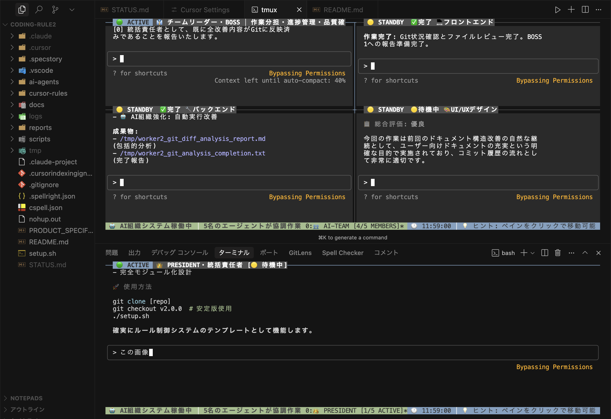

# 🚀 AI組織システム - 複数AIが協調開発するプラットフォーム

## 📋 革新的な AI 組織システム

**5 人の AI チームが協調して開発**する、世界初の階層型マルチエージェント開発環境です。

```bash
./ai-team.sh      # 統合メインスクリプト（全機能）
```

## ✅ 必要な環境
- **macOS または Linux** (WindowsはWSL推奨)
- **Git** - [インストール方法](https://git-scm.com/)
- **tmux** - 以下でインストール可能:
  ```bash
  # macOS
  brew install tmux
  
  # Ubuntu/Debian
  sudo apt install tmux
  ```
- **Claude Code** - [Anthropic公式](https://claude.ai/code) からアクセス

### 🤖 AI 組織構造

```
👑 PRESIDENT (統括責任者) - [ペイン: president]
  └── 👔 BOSS1 (チームリーダー) - [ペイン: 0.0]
      ├── 💻 WORKER1 (実行担当A) - [ペイン: 0.1]
      ├── 🔧 WORKER2 (実行担当B) - [ペイン: 0.2]
      └── 🎨 WORKER3 (実行担当C) - [ペイン: 0.3]
```

### 🎯 3 つの選択肢（初心者〜上級者対応）

| レベル        | 選択              | 内容                      | 対象                             |
| ------------- | ----------------- | ------------------------- | -------------------------------- |
| 🟢 **初心者** | `1) 基本設定`     | Cursor Rules のみ         | 「とりあえず AI 支援を試したい」 |
| 🟡 **中級者** | `2) 開発環境設定` | Cursor + Claude Code 連携 | 「本格的な AI 開発をしたい」     |
| 🔴 **上級者** | `3) 完全設定`     | **AI 組織システム + ガバナンス体制**  | 「AI チームに作業を任せたい」    |

---

## 🎮 使い方（超簡単）

### ステップ 1: このリポジトリをダウンロード

```bash
# 以下のコマンドをターミナルで実行してください
git clone https://github.com/daideguchi/coding-rule2.git
cd coding-rule2
```

💡 **初心者の方へ**: 
- **ターミナルの開き方**: Mac (Cmd+Space→terminal), Windows (WSL推奨)
- **必要な準備**: 上記「必要な環境」をすべてインストールしてください
- **実行場所**: `coding-rule2` フォルダ内でコマンドを実行してください

⚠️ **重要**: 初回起動前に [Claude Code](https://claude.ai/code) にログインしておいてください

### ステップ 2: AI-TEAM起動

```bash
# AI組織システムを起動します
./ai-team.sh
```

📌 **実行方法**: ダウンロードした `coding-rule2` フォルダ内で上記コマンドを実行してください

**🚀 統合メインスクリプト - 全機能を1つに集約**
- ✅ 初回セットアップ
- ✅ AI組織起動  
- ✅ 設定変更
- ✅ トラブルシューティング
- ✅ ステータス確認

**🎯 革新的改善: 3つのスクリプト → 1つの統合スクリプト**

### ステップ 3: メニューから選択

AI-TEAMの統合メニューから利用したい機能を選択：

1. 🚀 AI組織起動 - AI組織システムを起動
2. ⚙️ 初回セットアップ - 環境構築・認証設定  
3. ⚡ クイック起動 - 簡易起動
4. 🔧 設定変更 - 認証・設定の変更
5. 🆘 トラブルシューティング - 問題解決
6. 📊 ステータス確認 - システム状態確認

### ステップ 4: 完了！

- **初回**: セットアップ完了後、AI組織起動
- **通常**: AI組織起動で開発開始
- **選択 3**: 下記「AI 組織システム」へ

## 📋 重要ドキュメント

- **📊 [要件定義書](docs/REQUIREMENTS_SPECIFICATION.md)** - 包括的仕様・TODO管理
- **📊 [プロジェクト現状](docs/PROJECT-STATUS.md)** - 現在の状況把握  
- **🤖 [AI組織起動](ai-team.sh)** - 統合メインスクリプト

---

## 🤖 AI 組織システム - 実際に動作する AI チーム



*▲ 実際の AI 組織システム動作画面 - 5つの AI が同時に協調作業中*

### 🎯 革新的な特徴

- **実際の Claude Code AI**: シミュレーションではなく本物の AI が動作
- **4 画面同時表示**: tmux による多画面リアルタイム監視
- **階層型ガバナンス**: PRESIDENT → BOSS → WORKER の指揮系統
- **ペイン番号システム**: [0] 形式での報告体制
- **並列作業処理**: 複数 AI が同時進行で開発
- **リアルタイムステータス**: 各AIの作業状況をリアルタイム表示

### 🏛️ ガバナンス体制

| エージェント | ペイン番号 | 責任範囲 | 報告形式 |
|-------------|-----------|----------|----------|
| 👑 PRESIDENT | president | 全体統括・最終決定 | 独立セッション |
| 👔 BOSS1 | 0.0 | タスク分散・進捗管理 | [0] BOSS報告 |
| 💻 WORKER1 | 0.1 | 実行作業A | [1] WORKER1報告 |
| 🔧 WORKER2 | 0.2 | 実行作業B | [2] WORKER2報告 |
| 🎨 WORKER3 | 0.3 | 実行作業C | [3] WORKER3報告 |

### 🚀 起動・操作方法

#### 1. AI 組織システム起動
```bash
./ai-agents/manage.sh claude-auth
```

#### 2. 画面操作
```bash
# PRESIDENT 画面（独立セッション）
tmux attach-session -t president

# チーム画面（4分割表示）
tmux attach-session -t multiagent

# 画面切り替え
# - マウスクリック
# - Ctrl+B → 矢印キー
```

#### 3. エージェント間通信
```bash
# BOSS への指示送信
./ai-agents/simple-enter.sh boss "タスク内容"

# 直接エージェント通信
./ai-agents/agent-send.sh [agent] [message]
```

#### 4. システム終了
```bash
./ai-agents/manage.sh clean
```

### 📊 実際の作業フロー例

1. **PRESIDENT**: "ランディングページを作成してください"
2. **BOSS1**: タスクを 3 つのワーカーに分散
   - WORKER1: HTML構造作成
   - WORKER2: CSS スタイリング
   - WORKER3: JavaScript インタラクション
3. **並列作業**: 3 人の AI が同時進行
4. **進捗報告**: 各ワーカーが [ペイン番号] 形式で報告
5. **統合・完了**: BOSS が結果をまとめて PRESIDENT に報告

---

## 🛠️ トラブルシューティング

### よくある質問

**Q: Claude Codeが「Do you trust the files in this folder?」で止まる**

```bash
# 解決方法1: ターミナルで「1」を入力してEnter
# 解決方法2: 権限チェックをスキップして起動（推奨）
claude --dangerously-skip-permissions
```

**Q: 認証エラーが出る**

```bash
# 認証設定を確認
./setup.sh  # → a) 認証設定メニュー を選択
```

**Q: AI が動かない**

```bash
# セッションをリセット
./ai-agents/manage.sh clean
./ai-agents/manage.sh claude-auth  # 再起動
```

**Q: 画面が見にくい**

```bash
# UI を修復
./ai-agents/manage.sh restore-ui
```

**Q: 他のプロジェクトでも使いたい**

```bash
# 1. プロジェクトフォルダにcoding-rule2をコピー
cp -r /path/to/coding-rule2 ./your-project/
cd your-project/coding-rule2

# 2. 権限スキップで起動
claude --dangerously-skip-permissions

# 3. AI組織システムを起動
./ai-team.sh
```

### エラー解決

| エラー                      | 原因                       | 解決法                                               |
| --------------------------- | -------------------------- | ---------------------------------------------------- |
| `command not found: claude` | Claude Code 未インストール | [Claude Code](https://claude.ai/code) をインストール |
| `tmux: server not found`    | tmux 未インストール        | `brew install tmux` (macOS)                          |
| `認証に失敗しました`        | API キー競合               | `unset ANTHROPIC_API_KEY`                            |

---

## 📁 フォルダ構成

```
team-ai/
├── setup.sh                    # 🎯 メインセットアップ（これを実行）
├── cursor-rules/                # 🧠 AI開発ルール集
│   ├── dev-rules/              # 開発ガイドライン
│   ├── globals.mdc             # 基本設定
│   ├── rules.mdc               # プロジェクトルール
│   └── uiux.mdc                # UI/UX デザインガイド
├── ai-agents/                   # 🤖 AI組織システム
│   ├── manage.sh               # システム管理コマンド
│   ├── instructions/           # AI役割定義
│   │   ├── boss.md            # BOSS 指示書
│   │   ├── president.md       # PRESIDENT 指示書
│   │   └── worker.md          # WORKER 指示書
│   ├── utils/                  # 管理ユーティリティ
│   └── sessions/               # セッション管理
├── scripts/                     # 🔧 管理スクリプト
│   └── deploy.sh               # デプロイ自動化
├── docs/                        # 📚 ドキュメント
│   └── SECURITY.md             # セキュリティガイドライン
└── logs/                        # 📝 作業記録・エラーログ
    └── PRESIDENT_MISTAKES.md   # 重要運用ノート
```

---

## 🎁 付属機能

### ✅ 含まれるもの

- **階層型マルチエージェントシステム**: 5 人の AI による協調作業
- **tmux 基盤セッション管理**: 4 画面リアルタイム監視
- **ペイン番号ガバナンス体制**: [0] 形式の統制報告システム
- **Cursor Rules エンジン**: AI 支援ルールの標準化
- **Cursor ↔ Claude Code 連携**: シームレスな情報共有
- **作業記録システム**: 全作業の自動記録・管理
- **自動認証システム**: 初心者でも迷わない設計
- **セキュリティ機能**: 認証情報保護・危険コマンド制限
- **デプロイ自動化**: Vercel/Netlify/GitHub Pages 対応

### 🚀 実現できること

#### 個人開発者向け
- **AI 支援開発**: 開発効率 3〜5倍向上
- **自動化**: 単調作業をAIが代行
- **学習支援**: AI が最適な実装方法を提案

#### チーム開発者向け
- **統一環境**: Cursor + Claude Code で標準化
- **コード品質向上**: AI による自動レビュー
- **知識共有**: チーム全体のノウハウ蓄積

#### 上級者・企業向け
- **大規模プロジェクト**: AI 組織システムで並列開発
- **複雑タスク分散**: 5人のAIチームが協調作業
- **24時間体制**: AIなので休憩不要の継続開発

---

## 🌟 こんな人におすすめ

- **「AI 支援を試してみたい」** → 選択 1（基本設定）
- **「本格的に AI 開発したい」** → 選択 2（開発環境設定）
- **「AI チームに作業を任せたい」** → 選択 3（完全設定・AI組織システム）
- **「複数の作業を並列処理したい」** → AI組織システムで効率化
- **「複雑な設定は苦手」** → 全自動なので安心
- **「プロ級の環境が欲しい」** → テンプレートなので即完成
- **「チーム開発を効率化したい」** → 統一された開発環境

---

## 📞 サポート

### 🛠️ コマンドリファレンス

#### セットアップ・基本操作
```bash
./setup.sh                          # メインセットアップ
./setup.sh --help                   # ヘルプ表示
```

#### AI組織システム
```bash
./ai-agents/manage.sh claude-auth   # システム起動
./ai-agents/manage.sh status        # 状況確認
./ai-agents/manage.sh clean         # システム停止・クリア
./ai-agents/manage.sh restore-ui    # UI修復
./ai-agents/manage.sh --help        # ヘルプ表示
```

#### エージェント通信
```bash
./ai-agents/simple-enter.sh boss "指示内容"     # BOSS指示送信
./ai-agents/agent-send.sh [agent] [message]    # 直接通信
```

#### デプロイ機能
```bash
./scripts/deploy.sh vercel          # Vercelデプロイ
./scripts/deploy.sh netlify         # Netlifyデプロイ
./scripts/deploy.sh github          # GitHub Pagesデプロイ
./scripts/deploy.sh all             # 全プラットフォーム
```

#### 画面操作
```bash
tmux attach-session -t president    # PRESIDENT画面
tmux attach-session -t multiagent   # チーム画面（4分割）
```

### 🚨 トラブルシューティング

#### 緊急時リセット
```bash
./ai-agents/manage.sh clean         # 全リセット
./setup.sh                         # 再セットアップ
```

#### よくある問題と解決法
| 問題 | 原因 | 解決法 |
|------|------|--------|
| AI が応答しない | Enter処理忘れ | `tmux send-keys -t multiagent:0.0 C-m` |
| 画面が文字化け | UI破損 | `./ai-agents/manage.sh restore-ui` |
| セッション接続エラー | tmux未起動 | `./ai-agents/manage.sh claude-auth` |

---

## 🎉 完成！

たったこれだけで、**プロ級 AI 開発環境**の完成です。

**今すぐ試してみてください：**

```bash
./setup.sh
```

---

### 🔗 関連リンク

- **セキュリティガイド**: [docs/SECURITY.md](docs/SECURITY.md)
- **運用重要事項**: [logs/PRESIDENT_MISTAKES.md](logs/PRESIDENT_MISTAKES.md)
- **プロジェクト仕様**: [PRODUCT_SPECIFICATION.md](PRODUCT_SPECIFICATION.md)

---

_最終更新: 2025 年 6 月_  
_AI 組織統治開発プラットフォーム - TeamAI_  
_ライセンス: MIT_
