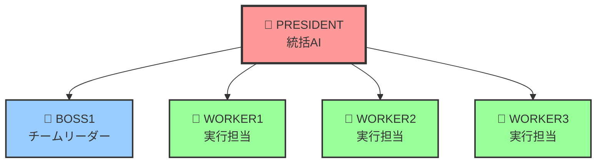

# 🤖 CodingRule2 - AI 組織開発システム

<div align="center">

**🚀 日本語対応の階層型マルチエージェント AI 組織で開発を革新 🚀**

[](./setup.sh)
[](#特徴)
[](./LICENSE)
[](#ai-組織構成)

</div>

---

## 📋 目次

<div align="center">

| セクション | 内容 | 所要時間 |
|-----------|------|----------|
| [🚀 最速セットアップ](#-最速セットアップ2-分) | セットアップガイド | 2分 |
| [🎯 使い方](#-使い方超簡単) | 基本的な使用方法 | 3分 |
| [📦 設定パターン](#-選べる-3-パターン) | 3つの設定パターン | 1分 |
| [🔧 トラブルシューティング](#-トラブルシューティング) | 問題解決ガイド | 5分 |

</div>

---

## 🚀 **最速セットアップ（2 分）**

<div align="center">

### 🎯 **3ステップで完了**

</div>

<details>
<summary>📋 <strong>詳細手順を表示</strong></summary>

```bash
# 1️⃣ セットアップ実行
./setup.sh

# 2️⃣ 認証設定（重要！）
./setup.sh → a) 認証設定 → Proプラン または API Key を選択

# 3️⃣ AI組織システム起動
./ai-agents/manage.sh claude-auth
```

</details>

<div align="center">

| ステップ | 操作 | 所要時間 | 成功指標 |
|---------|------|----------|----------|
| 1️⃣ | セットアップ実行 | 30秒 | ✅ 設定ファイル生成 |
| 2️⃣ | 認証設定 | 1分 | ✅ Claude認証完了 |
| 3️⃣ | AI組織起動 | 30秒 | ✅ 5つのAIが起動 |

**🎉 これで完了！PRESIDENT + 4 つのワーカー AI が自動起動します**

</div>

---

## 🎯 **使い方（超簡単）**

<div align="center">

### 🔥 **3ステップワークフロー**

</div>

### **Step 1: AI 組織システム起動**

```bash
./ai-agents/manage.sh claude-auth
```

<div align="center">

| 機能 | 状態 | 説明 |
|------|------|------|
| 🔐 認証設定 | ✅ 自動選択 | 設定済み認証を自動検出 |
| 👑 PRESIDENT | ✅ 自動起動 | 統括AIが起動 |
| 👥 4ワーカー | ✅ 自動起動 | 実行担当AIが起動 |
| 🗾 日本語対応 | ✅ 完全対応 | 全AIが日本語で対話 |

</div>

### **Step 2: プロジェクト指示**

**PRESIDENT 画面**でプロジェクトを指示するだけ：

<details>
<summary>💡 <strong>指示例を表示</strong></summary>

**初心者向け:**
```
Hello Worldプロジェクトを作成してください
```

**Web開発:**
```
Python FlaskでTodoアプリを作成してください。API設計、フロントエンド、テストまで含めて
```

**データ分析:**
```
CSVファイルを読み込んで可視化するPythonスクリプトを作成してください
```

</details>

### **Step 3: AI 活動監視**

**ターミナル 2**で 4 つの AI の活動をリアルタイム監視：

```bash
tmux attach-session -t multiagent
```

<div align="center">

**🤖 AI同士が日本語で相談しながら、実際にファイルを作成します！**

</div>

---

## 🤖 **AI 組織構成**

<div align="center">



</div>

<div align="center">

| 役割 | AI | 主な機能 | 特徴 |
|------|----|---------|----- |
| 🎯 統括 | 👑 PRESIDENT | プロジェクト全体統括 | 日本語指示対応・方針決定 |
| 📋 管理 | 👔 BOSS1 | チームリーダー | 作業分担・進捗管理 |
| ⚡ 実行 | 👷 WORKER1-3 | 実行担当 | ファイル作成・編集・実行 |

</div>

<div align="center">

**💪 実際にファイル作成・コード生成・実行を行います！**

</div>

---

## 🔐 **認証設定（重要）**

| 認証方法                    | 特徴                   | 推奨対象 |
| --------------------------- | ---------------------- | -------- |
| **🏆 claude.ai Pro プラン** | 高性能・安定・月額固定 | **推奨** |
| **🔑 ANTHROPIC_API_KEY**    | 従量課金・開発者向け   | テスト用 |

```bash
# 認証設定
./setup.sh → a) 認証設定 → 使いたい方法を選択

# 認証競合エラーが出た場合
./setup.sh → a) 認証設定 → 3) 現在の設定確認
```

---

## 🎬 **実際の使用例**

### **Web 開発プロジェクト**

```
PRESIDENT画面で指示:
「Python FlaskでTodoアプリを作成してください。API設計、フロントエンド、テストまで含めて」
```

### **データ分析プロジェクト**

```
PRESIDENT画面で指示:
「CSVファイルを読み込んで可視化するPythonスクリプトを作成してください」
```

**AI 同士が日本語で相談しながら、実際にファイルを作成します！**

---

## 🔧 **トラブルシューティング**

### **認証エラー**

```bash
# 1. 認証状況確認
./setup.sh → a) 認証設定 → 3) 現在の設定確認

# 2. 認証方法選択
./setup.sh → a) 認証設定 → 使いたい方法を選択
```

### **stdin Raw mode エラー**

```bash
# stdin エラー自動修正
./ai-agents/claude-stdin-fix.sh auto president 0

# エラー状況確認
./ai-agents/claude-stdin-fix.sh check president 0

# 手動修正（PTY使用）
./ai-agents/claude-stdin-fix.sh pty president 0
```

### **AI 組織システムが起動しない**

```bash
# 完全リセット
./ai-agents/manage.sh clean
./ai-agents/manage.sh claude-auth
```

---

## 🌟 **特徴**

- 🎯 **日本語完全対応** - 全 AI が日本語で対話
- 🚀 **ワンコマンド起動** - `claude-auth`で全自動
- 👥 **5 つの AI エージェント** - 階層型組織
- 🔧 **実際の開発支援** - ファイル作成・編集・実行

---

## 📦 **選べる 3 パターン**

<div align="center">

```bash
./setup.sh
```

**🎯 用途に応じて最適なパターンを選択**

</div>

<div align="center">

| パターン | 機能 | 対象ユーザー | 推奨度 | セットアップ時間 |
|----------|------|-------------|--------|-----------------|
| 🟢 **基本版** | Cursor Rules のみ | 個人開発・初心者 | ⭐⭐⭐ | 30秒 |
| 🟡 **開発版** | Cursor + Claude Code | チーム開発・実務 | ⭐⭐⭐⭐ | 1分 |
| 🔴 **完全版** | AI組織システム | 高度な開発・研究 | ⭐⭐⭐⭐⭐ | 2分 |

</div>

<details>
<summary>📋 <strong>各パターンの詳細比較</strong></summary>

### 🟢 **パターン 1: 基本版**
- ✅ Cursor Rules のみ
- ✅ 軽量で最小限の構成
- ✅ 学習コスト低
- 💡 個人開発・初心者に最適

### 🟡 **パターン 2: 開発版**
- ✅ Cursor Rules + Claude Code 連携
- ✅ 開発作業に必要な基本環境
- ✅ Cursor↔Claude同期機能
- 💡 チーム開発・実務に最適

### 🔴 **パターン 3: 完全版（AI 組織システム）**
- ✅ 全機能 + 5 つの AI エージェント組織
- ✅ マルチエージェント連携
- ✅ 大規模プロジェクト対応
- 💡 **推奨** - 高度な開発・研究に最適

</details>

---

<details>
<summary>🔽 その他のコマンド（上級者向け）</summary>

## 🛠️ **セッション操作コマンド**

```bash
# 画面確認・操作
./ai-agents/manage.sh president          # PRESIDENT画面
./ai-agents/manage.sh multiagent         # 4画面確認
tmux attach-session -t president         # PRESIDENT直接接続
tmux attach-session -t multiagent        # 4画面直接接続

# システム管理
./ai-agents/manage.sh clean              # 全セッション削除
./ai-agents/manage.sh status             # システム状況確認
./ai-agents/manage.sh auto               # 旧起動方法（非推奨）
```

## 📁 **ファイル構成**

```
coding-rule2/
├── 📁 cursor-rules/              # AI開発ルール集
├── 📁 ai-agents/                # AI組織システム
│   ├── instructions/            # エージェント指示書
│   ├── logs/                    # AI活動ログ
│   └── manage.sh                # 管理スクリプト
├── 📄 setup.sh                  # セットアップスクリプト
└── 📄 README.md                 # このファイル
```

## 🎯 **参考リポジトリ**

- [Claude Code Communication](https://github.com/Akira-Papa/Claude-Code-Communication)

</details>

---

<div align="center">

## 🚀 **今すぐ始めよう！**

**たった 3 ステップで、日本語対応 AI 組織システムを体験！**

```bash
./setup.sh
```

---

### 📊 **プロジェクト統計**

| 項目 | 値 |
|------|-----|
| 🤖 AI エージェント数 | 5個 |
| ⚡ セットアップ時間 | 2分 |
| 🗾 対応言語 | 日本語完全対応 |
| 📦 設定パターン | 3種類 |
| 🔧 対応OS | macOS, Linux |

---

[](https://github.com/your-repo)
[](./LICENSE)
[](./STATUS.md)

---

*Last updated: 2025-06-27 01:00*  
*README improved version by Worker1 - より見やすく、より使いやすく*

</div>
