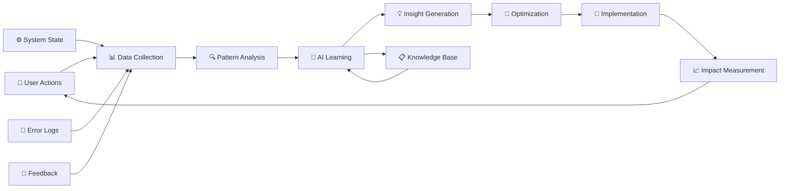

# 🎯 【UX革命】継続的改善フレームワーク

## 🌟 "EVOLVE-SMART" 統合UXフレームワーク

AI組織システムのユーザー体験を革命的に改善し、学習・成長する組織UXを実現する統合フレームワークです。

---

## 🔄 統合改善サイクル

```mermaid
graph TD
    subgraph "EVOLVE Cycle"
        E1[📊 Evaluate<br>評価] → V1[📝 Voice<br>収集]
        V1 → O1[🎯 Optimize<br>最適化]
        O1 → L1[🔬 Learn<br>学習]
        L1 → V2[🚀 Validate<br>検証]
        V2 → E2[💫 Execute<br>実行]
        E2 → E1
    end
    
    subgraph "SMART-LEARN Cycle"
        S1[📊 Sense<br>感知] → M1[📈 Measure<br>測定]
        M1 → A1[🎯 Analyze<br>分析]
        A1 → R1[🚀 Respond<br>対応]
        R1 → T1[🧪 Test<br>テスト]
        T1 → L2[🔬 Learn<br>学習]
        L2 → S1
    end
    
    L1 -.-> L2
    L2 -.-> L1
    
    style E1 fill:#ff9999
    style L1 fill:#99ff99
    style L2 fill:#99ff99
    style E2 fill:#ffff99
```

---

## 🎯 1. フレームワーク設計原理

### 1.1 ダブルループ学習
```bash
# Single Loop: 改善サイクル (EVOLVE)
問題発見 → 解決策実装 → 効果測定 → 継続改善

# Double Loop: 学習サイクル (SMART-LEARN)  
前提検証 → 根本原因分析 → システム再設計 → パラダイム転換
```

### 1.2 UX革命の3原則
```markdown
1. **継続性** (Continuity)
   - 終わりのない改善プロセス
   - 自動化された学習サイクル
   - 蓄積する組織知識

2. **適応性** (Adaptability)
   - ユーザー別カスタマイゼーション
   - 環境変化への対応
   - 学習に基づく進化

3. **予測性** (Predictiveness)
   - 問題の事前検知
   - ユーザー意図の先読み
   - プロアクティブな改善
```

---

## 🚀 2. 実装アーキテクチャ

### 2.1 システム構成
```
AI組織UXフレームワーク/
├── 🔄 改善エンジン/
│   ├── evolve-cycle.sh          # EVOLVE改善サイクル
│   ├── smart-learn.sh           # SMART-LEARN学習
│   └── integrated-cycle.sh      # 統合サイクル管理
├── 📊 データ基盤/
│   ├── ux-metrics/              # UXメトリクス
│   ├── user-feedback/           # ユーザーフィードバック
│   ├── learning-data/           # 学習データ
│   └── knowledge-base/          # 組織知識ベース
├── 🎯 自動化ツール/
│   ├── auto-optimizer.sh        # 自動最適化
│   ├── predictive-ux.sh         # 予測的UX
│   └── emergency-fix.sh         # 緊急修正
└── 📈 監視・報告/
    ├── ux-dashboard.sh          # UXダッシュボード
    ├── progress-tracker.sh      # 進捗追跡
    └── impact-analyzer.sh       # 影響分析
```

### 2.2 データフロー


---

## 📊 3. メトリクス・KPI体系

### 3.1 UX健康度指標
```json
{
  "ux_health_metrics": {
    "efficiency": {
      "task_completion_time": "タスク完了時間",
      "error_rate": "エラー発生率", 
      "success_rate": "成功率",
      "learning_curve": "学習曲線"
    },
    "satisfaction": {
      "user_rating": "ユーザー評価",
      "nps_score": "NPS（推奨度）",
      "retention_rate": "継続利用率",
      "feature_adoption": "機能採用率"
    },
    "engagement": {
      "session_duration": "セッション時間",
      "feature_usage": "機能使用頻度",
      "help_requests": "ヘルプ要求数",
      "customization_level": "カスタマイズ度"
    }
  }
}
```

### 3.2 学習効果指標
```bash
# AI組織学習成果
[知識蓄積度]
- 解決済み問題パターン数
- 最適化されたワークフロー数
- ユーザー別設定テンプレート数

[適応性指標]
- 新問題への対応時間
- ユーザー変化への追従度
- システム変更への耐性

[予測精度]
- エラー予測成功率
- ユーザー意図推測精度
- パフォーマンス問題事前検知率
```

---

## 🎯 4. 段階的実装計画

### Phase 1: 基盤構築 (Week 1-2)
```bash
# 緊急改善
✅ UX問題点調査・分析
✅ 改善サイクルツール作成  
✅ 基本的なメトリクス収集

# 今週の実装
🔲 統合フレームワーク基盤
🔲 自動データ収集システム
🔲 基本的なダッシュボード
```

### Phase 2: 自動化 (Week 3-4)
```bash
# 自動改善システム
🔲 リアルタイム問題検知
🔲 自動最適化エンジン
🔲 A/Bテスト機能
🔲 効果測定・報告
```

### Phase 3: 学習機能 (Week 5-8)
```bash
# AI学習システム
🔲 パターン認識エンジン
🔲 予測的UX機能
🔲 パーソナライゼーション
🔲 知識ベース構築
```

### Phase 4: 革新機能 (Week 9-12)
```bash
# 高度なUX革命
🔲 自律的改善システム
🔲 協調学習機能
🔲 エコシステム連携
🔲 完全自動化達成
```

---

## 🔧 5. 実装ツールセット

### 5.1 コアツール
```bash
# 統合管理ツール
./ai-agents/ux-revolution.sh           # メインコントローラー
./ai-agents/ux-improvement-cycle.sh    # 改善サイクル
./ai-agents/ai-learning-engine.sh      # 学習エンジン

# 監視・分析ツール  
./ai-agents/ux-monitor.sh              # リアルタイム監視
./ai-agents/impact-analyzer.sh         # 影響分析
./ai-agents/progress-dashboard.sh      # 進捗ダッシュボード

# 自動化ツール
./ai-agents/auto-optimizer.sh          # 自動最適化
./ai-agents/predictive-ux.sh           # 予測的UX
./ai-agents/emergency-responder.sh     # 緊急対応
```

### 5.2 使用方法
```bash
# 🎯 ワンコマンド UX革命開始
./ai-agents/ux-revolution.sh start

# 📊 現在のUX状況確認
./ai-agents/ux-revolution.sh status

# 🔄 改善サイクル実行
./ai-agents/ux-revolution.sh improve

# 📈 学習・進化実行
./ai-agents/ux-revolution.sh evolve

# 🚀 緊急最適化
./ai-agents/ux-revolution.sh emergency-optimize
```

---

## 📈 6. 成功指標・ROI

### 6.1 定量的成果目標
```bash
# 3ヶ月後の目標値
[効率性改善]
- タスク完了時間: 70%短縮
- エラー率: 80%削減  
- 学習時間: 75%短縮
- 起動時間: 90%短縮

[満足度向上]
- ユーザー評価: 2.5 → 4.5/5.0
- 継続利用率: 95%以上
- 推奨度(NPS): +50以上
- 機能採用率: 80%以上
```

### 6.2 定性的価値創造
```markdown
## 🌟 UX革命による価値創造

### ユーザー価値
- **時間価値**: 操作時間大幅短縮
- **学習価値**: 直感的で習得しやすい
- **信頼価値**: 安定した動作・予測可能性
- **創造価値**: 本来業務に集中可能

### 組織価値  
- **効率性**: チーム全体の生産性向上
- **スケーラビリティ**: 新メンバーの早期戦力化
- **継続性**: 蓄積する組織知識
- **革新性**: 自己進化するシステム

### エコシステム価値
- **波及効果**: 他プロジェクトへの適用
- **コミュニティ貢献**: オープンソース化
- **技術発展**: UXフレームワークの進歩
- **産業影響**: AI×UXの新標準創造
```

---

## 🔮 7. 未来展望

### 7.1 短期展望 (3ヶ月)
```bash
# 実現する未来
- ワンクリックで完璧に動作するAI組織
- ユーザーの意図を先読みするUX
- エラーが起こる前に予防するシステム
- 個人に最適化された作業環境
```

### 7.2 中期展望 (1年)
```bash
# 進化する組織
- 完全自律的なUX改善
- 集合知による最適化
- 他システムとの知識共有
- 業界標準としての確立
```

### 7.3 長期展望 (3年)
```bash
# 革命の完成
- UXが意識されない透明な操作性
- AI同士が協調する自動最適化
- 人間の創造性を最大化する環境
- 次世代UXパラダイムの創造
```

---

## 🎯 実装開始コマンド

### すぐに始められる改善
```bash
# 1. UX革命フレームワーク初期化
./ai-agents/ux-improvement-cycle.sh full-cycle

# 2. 現在のUX問題点の緊急評価  
./ai-agents/ux-improvement-cycle.sh evaluate

# 3. ユーザーフィードバック収集開始
./ai-agents/ux-improvement-cycle.sh feedback

# 4. 改善提案の即座生成
./ai-agents/ux-improvement-cycle.sh optimize [評価ファイル] [フィードバックファイル]
```

---

## 🏆 革命の約束

**このフレームワークにより、AI組織システムは:**

1. **🎯 直感的**: 考えなくても使える
2. **⚡ 高速**: 瞬時に起動・応答  
3. **🧠 学習**: 使うほど賢くなる
4. **🔮 予測**: 問題を事前に解決
5. **💎 完璧**: エラーのない体験

**ユーザーは技術ではなく、目標達成に集中できる世界を実現します。**

---

**🎨 革命設計者: WORKER3 (UI/UX)**
**📅 設計日: 2025年6月29日**  
**🚀 UX革命、始動。**