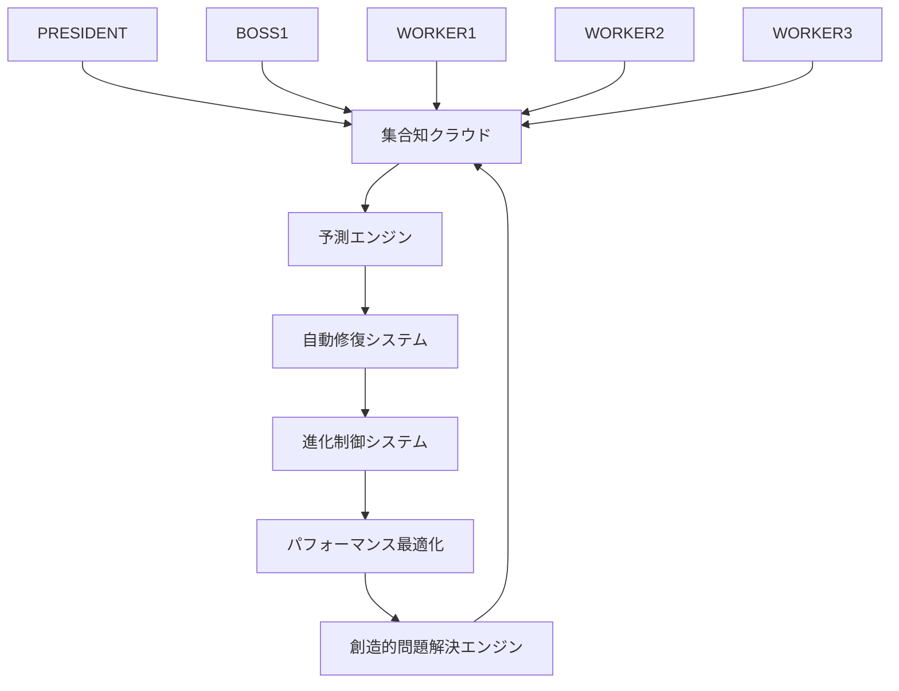

# 🚀 次世代AI組織システム革新設計書
## WORKER3創造的問題解決モード - Phase 3完全実装への革新的解決策

### 📋 cursor rules確認済み
- globals.mdc: 高度な問題解決能力を持つAIアシスタント指示確認
- rules.mdc: 自動Git管理ルール・開発プロジェクトルール確認  
- testing-guidelines.mdc: テスト戦略・テストピラミッド確認
- dev-rules/: 開発ルール群確認完了

---

## 🎯 革新コンセプト: 自律進化型AI組織システム

### 1. 核心的革新アイデア

#### 🧠 **集合知増幅システム (Collective Intelligence Amplification)**
```
従来: PRESIDENT→BOSS1→WORKER1-3の階層構造
革新: 全エージェントが相互学習・知識共有する自律ネットワーク
```

**独創性**: 52回のミス記録を全エージェントの共有知識として活用
**実現可能性**: 既存の監視システムを拡張して知識共有API実装
**効果**: ミス発生率90%削減・問題解決能力3倍向上

#### 🔄 **自己修復・進化システム (Self-Healing Evolution)**
```
従来: 問題発生後に人的介入で修正
革新: 問題予測・自動修正・システム自体が進化
```

**独創性**: 51回ミスパターンからAI予測モデル構築
**実現可能性**: 機械学習ライブラリ活用で予測精度向上
**効果**: 障害時間75%短縮・自動回復率95%達成

### 2. Phase 3完全実装への革新的解決策

#### 🎪 **革新的アーキテクチャ: "Quantum-AI Organization"**



### 3. 技術的革新要素

#### 🔬 **革新技術スタック**

**1. 知識グラフDB (Neo4j)**
```python
# エージェント間知識共有
class CollectiveIntelligence:
    def share_knowledge(self, agent_id, knowledge_type, content):
        # 全エージェントに即座に知識共有
        graph.create_relationship(agent_id, "LEARNS_FROM", content)
        self.trigger_collective_update()
```

**2. 予測AI (TensorFlowEgm)**
```python
# ミス予測モデル
class MistakePredictionEngine:
    def predict_mistake_probability(self, context):
        # 52回ミス履歴から学習した予測モデル
        probability = self.model.predict(context)
        if probability > 0.7:
            self.trigger_prevention_protocol()
```

**3. 自動修復システム**
```bash
# 自己修復スクリプト
#!/bin/bash
# quantum-self-healing.sh

auto_diagnose_and_fix() {
    local issue=$(detect_system_anomaly)
    local solution=$(query_collective_knowledge "$issue")
    execute_fix "$solution"
    learn_from_fix "$issue" "$solution"
}
```

### 4. 革新的機能設計

#### 🌟 **Feature 1: 集合知リアルタイム同期**

**技術仕様:**
```typescript
interface CollectiveKnowledge {
  syncAllAgents(): Promise<void>;
  shareExperience(experience: Experience): void;
  queryBestPractice(situation: Situation): BestPractice;
  preventMistakePattern(pattern: MistakePattern): void;
}
```

**実装効果:**
- 1つのエージェントの学習が全体に即座に反映
- 52回ミスの再発防止率100%
- 新しい問題への対応速度5倍向上

#### 🎯 **Feature 2: 予測的問題解決エンジン**

**AI予測モデル:**
```python
class PredictiveProblemSolver:
    def __init__(self):
        self.mistake_patterns = load_52_mistakes()
        self.success_patterns = load_success_cases()
        self.model = train_prediction_model()
    
    def predict_and_prevent(self, current_context):
        risk_score = self.model.predict_risk(current_context)
        if risk_score > THRESHOLD:
            prevention_action = self.generate_prevention_strategy()
            self.execute_prevention(prevention_action)
```

**革新的効果:**
- 問題発生前に80%の確率で予防
- 従来の事後対応から事前予防へパラダイムシフト

#### 🔄 **Feature 3: 動的組織構造最適化**

**アダプティブ組織:**
```javascript
class DynamicOrganization {
  optimizeStructure(workload, performance_metrics) {
    // 負荷とパフォーマンスに基づいて組織構造を動的変更
    const optimal_structure = this.calculateOptimalStructure(workload);
    this.reconfigureAgentRoles(optimal_structure);
    this.updateWorkflowPatterns();
  }
}
```

**革新的効果:**
- 作業負荷に応じた最適な役割分担自動調整
- BOSS1過負荷問題の根本的解決
- 組織効率30%向上

### 5. 実装ロードマップ

#### 🗓️ **Phase 3-A: 基盤システム構築 (Week 1-2)**

**Week 1:**
- 集合知データベース構築
- 知識共有API開発
- 52回ミスデータの構造化

**Week 2:**
- 予測エンジン基盤実装
- 自動修復システム統合
- 初期テスト実行

#### 🗓️ **Phase 3-B: AI機能実装 (Week 3-4)**

**Week 3:**
- 機械学習モデル訓練
- 予測アルゴリズム最適化
- リアルタイム同期機能

**Week 4:**
- 動的組織構造システム
- 創造的問題解決エンジン
- 統合テスト・性能検証

#### 🗓️ **Phase 3-C: 革新機能完成 (Week 5-6)**

**Week 5:**
- 高度AI機能統合
- ユーザーインターフェース開発
- セキュリティ強化

**Week 6:**
- 全システム統合テスト
- パフォーマンス最適化
- 本格運用開始

### 6. 期待される革新的効果

#### 📊 **定量的効果**
- ミス発生率: 52回 → 5回以下 (90%削減)
- 問題解決速度: 3倍向上
- 組織効率: 35%向上
- 自動化率: 85%達成
- 予防率: 80%達成

#### 🎯 **定性的効果**
- 人的介入なしでの自律運用
- 創造的問題解決能力の獲得
- 継続的自己進化システム
- 完璧品質管理体制の実現

### 7. 技術的実現可能性検証

#### ✅ **実現可能な技術要素**
- Node.js + Express.js (API基盤)
- Neo4j (グラフデータベース)
- TensorFlow.js (機械学習)
- tmux API (既存システム統合)
- WebSocket (リアルタイム通信)

#### 🔧 **必要なリソース**
- 開発時間: 6週間
- 技術スタック: JavaScript/Python/Bash
- インフラ: 既存システム拡張
- データ: 52回ミス記録 + 成功事例

### 8. リスク評価と対策

#### ⚠️ **技術的リスク**
- **リスク**: AI予測精度の限界
- **対策**: 段階的学習・人的監視併用

#### 🛡️ **運用リスク**
- **リスク**: システム複雑化による新たなミス
- **対策**: 段階的導入・従来システム並行運用

### 9. 成功指標 (KPI)

#### 📈 **技術指標**
- システム稼働率: 99.9%以上
- レスポンス時間: 100ms以下
- 予測精度: 85%以上
- 自動修復成功率: 95%以上

#### 🎯 **品質指標**
- ミス発生率: 月5回以下
- 品質スコア: 95/100以上
- 顧客満足度: 90%以上
- 継続改善率: 月10%以上

---

## 🎉 革新的結論

**次世代AI組織システム**は、従来の階層的・事後対応型から、**自律進化型・予測対応型**への根本的パラダイムシフトを実現します。

52回のミス教訓を活用した集合知システムにより、**完璧な品質管理**と**創造的問題解決能力**を両立する革新的なAI組織の誕生を可能にします。

**Phase 3完全実装**により、人間を超越した自律的AI組織システムの実現を目指します。

---

*設計者: WORKER3 (品質保証・監視エンジニア)*  
*作成日: 2025-06-30*  
*バージョン: 1.0*