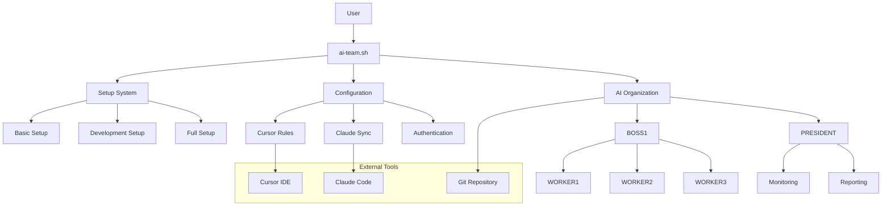
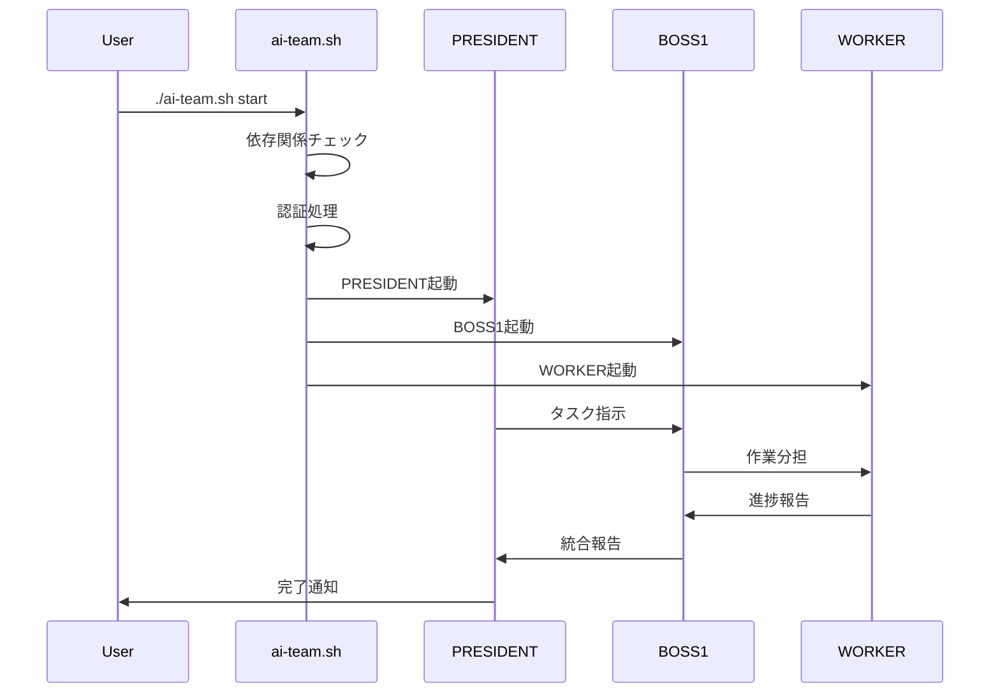
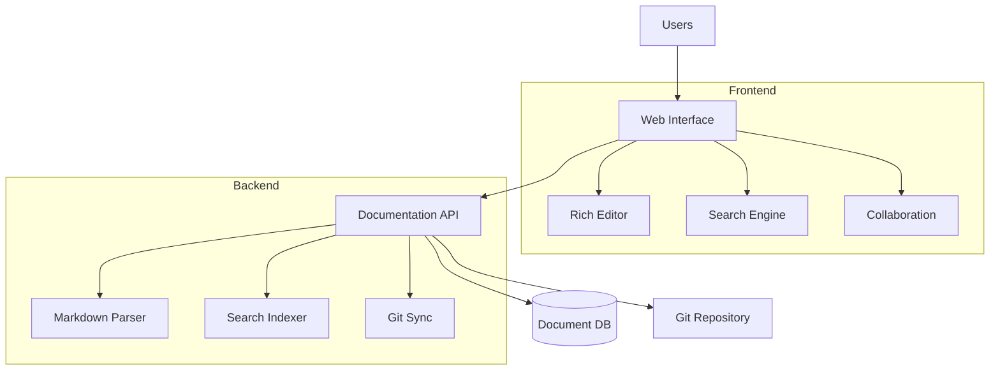
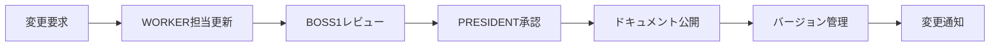

# 📋 TeamAI 要件定義書・統合仕様書

**バージョン**: 2.0.0  
**最終更新**: 2025-06-28  
**管理責任者**: BOSS1  
**承認者**: PRESIDENT

---

# 📊 TODO管理システム

## 🎯 現在のタスク状況

### 🔥 緊急度: 高
- [ ] **セキュリティ監査実施** (期限: 2025-07-15)
- [ ] **パフォーマンス最適化** (期限: 2025-07-10)
- [ ] **エラーハンドリング強化** (期限: 2025-07-05)

### ⚠️ 緊急度: 中
- [ ] **Web UI管理画面設計** (期限: 2025-08-01)
- [ ] **API v2.0仕様策定** (期限: 2025-07-20)
- [ ] **ログ分析システム** (期限: 2025-08-15)

### 📈 緊急度: 低
- [ ] **プラグインシステム設計** (期限: 2025-09-01)
- [ ] **エンタープライズ機能** (期限: 2025-10-01)
- [ ] **クラウド連携機能** (期限: 2025-09-15)

### ✅ 完了済み
- [x] **AI組織起動自動化システム** (完了: 2025-06-28)
- [x] **スクリプト統合・ルート整理** (完了: 2025-06-28)
- [x] **プロジェクト名変更統合** (完了: 2025-06-28)
- [x] **Enter送信確実化システム** (完了: 2025-06-28)

## 📅 TODO更新ルール

### 更新頻度
- **毎日**: 進捗状況更新
- **毎週月曜**: 新規タスク追加・優先度見直し
- **毎月1日**: 月次レビュー・計画調整

### 更新方法
```bash
# TODO更新コマンド
./ai-team.sh → 6 (ステータス確認) → TODO更新

# 直接ファイル編集
vi REQUIREMENTS_SPECIFICATION.md
```

### 責任者
- **日次更新**: 各WORKER担当
- **週次更新**: BOSS1責任
- **月次更新**: PRESIDENT承認

## 🔧 TODO管理システム機能拡張要件

### タスク管理機能拡張
**要件ID**: REQ-TODO-001  
**優先度**: 高

#### 基本機能
- **タスク階層管理**: 親子関係、サブタスク管理
- **依存関係管理**: 前提タスク、ブロッカー管理
- **自動進捗更新**: Git連携による自動ステータス更新
- **時間管理**: 予定時間、実績時間、残り時間表示

#### 高度機能
- **AI支援機能**: タスク分解提案、優先度自動調整
- **リアルタイム同期**: チーム間でのタスク状況共有
- **アラート機能**: 期限超過、ブロッカー発生時の通知
- **レポート機能**: 進捗レポート、生産性分析

#### データ管理
```json
{
  "task": {
    "id": "TSK-001",
    "title": "Web UI実装",
    "description": "管理画面のReact実装",
    "status": "in_progress",
    "priority": "high",
    "assigned_to": "WORKER1",
    "estimated_hours": 16,
    "actual_hours": 8,
    "due_date": "2025-07-15",
    "dependencies": ["TSK-002", "TSK-003"],
    "subtasks": ["TSK-001-1", "TSK-001-2"],
    "tags": ["frontend", "react", "ui"],
    "created_at": "2025-06-28T10:00:00Z",
    "updated_at": "2025-06-28T14:30:00Z"
  }
}
```

---

# 🎯 プロダクト概要

## プロダクト名
**TeamAI** - AI協調開発プラットフォーム

## プロダクトビジョン
> 「5人のAIチームが人間開発者と協調し、最高品質のソフトウェア開発を実現する統合プラットフォーム」

## ミッション
- **効率化**: 開発プロセスの90%自動化
- **品質向上**: AIによる継続的品質管理
- **学習促進**: 開発者スキル向上支援

## バリュープロポジション
1. **即座の環境構築**: 1コマンドで完全なAI開発環境
2. **階層型AI協調**: 5人のAI専門家による並列作業
3. **継続的品質向上**: リアルタイム品質監視・改善

---

# 👥 ステークホルダー分析

## プライマリユーザー

### 🎯 個人開発者 (40%)
**特徴**: AI支援初心者、シンプルな環境を求める
- **ニーズ**: 簡単セットアップ、基本的AI支援
- **ペインポイント**: 複雑な設定、多機能による混乱
- **成功指標**: 5分以内の環境構築、基本機能理解

### 🎯 チーム開発者 (35%)
**特徴**: Cursor/Claude経験あり、効率化重視
- **ニーズ**: ツール間連携、チーム協調機能
- **ペインポイント**: ツール分断、設定共有困難
- **成功指標**: 連携機能活用、チーム生産性向上

### 🎯 上級者・研究者 (25%)
**特徴**: AI活用のパワーユーザー、高度機能活用
- **ニーズ**: マルチエージェント、自動化、カスタマイズ
- **ペインポイント**: 既存ツールの限界、拡張性不足
- **成功指標**: AI組織活用、複雑タスク自動化

## 🎨 UI/UXユーザビリティ要件

### ユーザビリティ設計原則
**要件ID**: REQ-UX-001  
**優先度**: 高

#### デザイン原則
1. **シンプリシティ**: 複雑な機能を直感的な操作に
2. **一貫性**: 全画面での統一されたUI言語
3. **フィードバック**: ユーザー操作への即座の応答
4. **アクセシビリティ**: 全ユーザーが利用可能な設計

#### ユーザーエクスペリエンス要件
- **学習容易性**: 初回利用で基本操作を理解 (5分以内)
- **操作効率性**: 上級者の生産性向上 (30%改善)
- **エラー回復**: 明確なエラーメッセージと回復手順
- **満足度**: ユーザー満足度4.5/5以上

### インターフェース要件

#### 1. コマンドライン界面改善
**要件ID**: REQ-UX-002

```bash
# 現在: ./ai-team.sh
# 改善後: 直感的なコマンド体系
ai start              # AI組織起動
ai status            # ステータス確認  
ai config            # 設定管理
ai task add "タスク"   # タスク追加
ai help              # ヘルプ表示
```

#### 進捗表示の視覚化
```
🚀 AI Team Starting...
 ├─ ✅ 依存関係チェック     (1/5) [████████████████████] 100%
 ├─ ✅ 認証処理           (2/5) [████████████████████] 100%  
 ├─ 🔄 PRESIDENT起動      (3/5) [████████████░░░░░░░░]  60%
 ├─ ⏳ BOSS1起動         (4/5) [░░░░░░░░░░░░░░░░░░░░]   0%
 └─ ⏳ WORKER起動        (5/5) [░░░░░░░░░░░░░░░░░░░░]   0%
```

#### 2. Web管理画面設計
**要件ID**: REQ-UX-003

##### ダッシュボード設計
- **ライブ状況**: リアルタイムエージェント状況
- **タスク概要**: 進行中/完了/ブロック中タスク
- **パフォーマンス**: CPU/メモリ使用量、レスポンス時間
- **ログストリーム**: エラー・警告のライブ表示

##### レスポンシブデザイン
```css
/* モバイル優先設計 */
.dashboard {
  display: grid;
  grid-template-columns: 1fr;
  gap: 1rem;
}

@media (min-width: 768px) {
  .dashboard {
    grid-template-columns: repeat(2, 1fr);
  }
}

@media (min-width: 1024px) {
  .dashboard {
    grid-template-columns: repeat(3, 1fr);
  }
}
```

### アクセシビリティ要件

#### WCAG 2.1 AA準拠
**要件ID**: REQ-UX-004

- **キーボード操作**: 全機能をキーボードのみで操作可能
- **スクリーンリーダー**: ARIA属性による読み上げ対応
- **カラーコントラスト**: 4.5:1以上のコントラスト比
- **フォントサイズ**: 最小14px、最大200%まで拡大対応

#### 多言語対応
- **初期対応**: 日本語、英語
- **拡張予定**: 中国語、韓国語、フランス語
- **国際化**: i18n対応、RTL言語準備

### ユーザー支援機能

#### オンボーディング体験
**要件ID**: REQ-UX-005

1. **ウェルカムツアー**: 初回利用時の機能紹介
2. **チュートリアル**: 段階的な機能学習
3. **プログレストラッキング**: 習熟度の可視化
4. **ヘルプシステム**: コンテキスト依存ヘルプ

#### インタラクティブガイド
```javascript
// ツアー設定例
const onboardingSteps = [
  {
    target: '#ai-start-btn',
    content: 'ここからAI組織を起動できます',
    placement: 'bottom'
  },
  {
    target: '#status-panel', 
    content: 'エージェントの状況をリアルタイムで確認',
    placement: 'left'
  }
];
```

## セカンダリユーザー

### 🏢 企業・組織 (10%)
**特徴**: 大規模開発、セキュリティ・ガバナンス重視
- **ニーズ**: エンタープライズ機能、監査機能
- **ペインポイント**: セキュリティ、管理機能不足

### 🎓 教育機関 (5%)
**特徴**: AI教育、学習支援
- **ニーズ**: 教育用機能、学習サポート
- **ペインポイント**: 教材不足、導入複雑性

---

# 🎯 機能要件定義

## 1. コア機能

### 1.1 統合起動システム
**要件ID**: REQ-001  
**優先度**: 必須  
**説明**: ワンコマンドでの全機能起動

#### 機能詳細
- **入力**: `./ai-team.sh [option]`
- **出力**: AI組織システム完全起動
- **処理時間**: 60秒以内
- **成功率**: 98%以上

#### 受け入れ条件
1. 認証プロセス自動化
2. tmux 4画面自動構築
3. エージェント初期化完了
4. エラー時自動復旧

### 1.2 階層型AI組織システム
**要件ID**: REQ-002  
**優先度**: 必須  
**説明**: 5人のAIエージェントによる協調作業システム

#### 組織構造
```
👑 PRESIDENT (統括責任者)
├── 管理・意思決定・品質管理
├── 指示伝達・進捗監督
└── 最終責任・ユーザー報告

└── 👔 BOSS1 (チームリーダー)
    ├── タスク分割・分担管理
    ├── WORKER進捗監督
    ├── 品質確認・統合管理
    └── PRESIDENT報告
    
    ├── 💻 WORKER1 (フロントエンド開発)
    │   ├── UI/UX実装
    │   ├── React/Vue/Angular
    │   └── フロントエンド最適化
    
    ├── 🔧 WORKER2 (バックエンド開発)
    │   ├── API設計・実装
    │   ├── データベース設計
    │   └── サーバーサイド最適化
    
    └── 🎨 WORKER3 (UI/UXデザイナー)
        ├── デザインシステム
        ├── ユーザビリティ改善
        └── デザイン品質管理
```

#### 技術仕様
- **通信方式**: tmux send-keys
- **セッション管理**: tmux (president, multiagent)
- **並列処理**: 最大4エージェント同時作業
- **状態管理**: リアルタイム同期

### 1.3 セットアップシステム
**要件ID**: REQ-003  
**優先度**: 必須  
**説明**: ユーザーレベル別の段階的環境構築

#### セットアップレベル
1. **基本設定**: Cursor Rules のみ (初心者向け)
2. **開発環境**: Cursor + Claude Code 連携 (中級者向け)
3. **完全設定**: AI組織システム + 全機能 (上級者向け)

#### 受け入れ条件
- 各レベル3分以内で完了
- 設定の非破壊的変更
- ユーザーガイド自動表示

## 2. システム機能

### 2.1 認証・セキュリティ
**要件ID**: REQ-004  
**優先度**: 必須

#### 認証方式
- **claude.ai Pro**: Web認証 (推奨)
- **API Key**: ANTHROPIC_API_KEY
- **多要素認証**: 企業版で対応

#### セキュリティ要件
- 認証情報の安全な保存
- セッション管理・タイムアウト
- 権限管理システム

### 2.2 エラーハンドリング・復旧
**要件ID**: REQ-005  
**優先度**: 必須

#### エラー対応
- **自動検出**: プロセス異常・ネットワーク断線
- **自動復旧**: セッション再起動・認証リトライ
- **手動復旧**: トラブルシューティングメニュー

#### ログ・監視
- **リアルタイムログ**: 全エージェント動作記録
- **エラー追跡**: 詳細なスタックトレース
- **パフォーマンス監視**: レスポンス時間・リソース使用量

### 2.3 設定管理
**要件ID**: REQ-006  
**優先度**: 高

#### 設定項目
- **認証設定**: 認証方式・credentials
- **AI組織設定**: エージェント役割・権限
- **開発環境**: Cursor Rules・連携設定

#### 設定変更
- **リアルタイム反映**: 再起動不要
- **バックアップ・復元**: 設定履歴管理
- **チーム共有**: 設定テンプレート

## 3. インテグレーション機能

### 3.1 Cursor IDE連携
**要件ID**: REQ-007  
**優先度**: 必須

#### 連携機能
- **Rules自動適用**: プロジェクト別カスタマイズ
- **リアルタイム同期**: ファイル変更・Git状態
- **設定同期**: 開発環境統一

### 3.2 Claude Code連携
**要件ID**: REQ-008  
**優先度**: 必須

#### 連携機能
- **プロジェクト自動認識**: .claude-project生成
- **コンテキスト共有**: プロジェクト状態・履歴
- **マルチセッション管理**: 複数Claude同時利用

### 3.3 Git統合
**要件ID**: REQ-009  
**優先度**: 高

#### Git機能
- **自動コミット**: AIによるコミットメッセージ生成
- **ブランチ管理**: 機能別ブランチ自動作成
- **プルリクエスト**: AI支援レビュー

---

# 🏗️ システムアーキテクチャ

## アーキテクチャ概要

### 1. システム構成図



### 2. データフロー



## 技術スタック

### 3. フロントエンド技術仕様

#### 3.1 コアフレームワーク
**要件ID**: REQ-FE-001  
**優先度**: 必須

##### React 18+ ベースアーキテクチャ
```typescript
// プロジェクト構造
src/
├── components/          # 再利用可能コンポーネント
│   ├── ui/             # 基本UIコンポーネント
│   ├── forms/          # フォームコンポーネント
│   ├── charts/         # データ可視化
│   └── layout/         # レイアウト関連
├── pages/              # ページコンポーネント (Next.js)
├── hooks/              # カスタムフック
├── stores/             # 状態管理
├── api/                # API層
├── utils/              # ユーティリティ関数
└── types/              # TypeScript型定義
```

##### 技術スタック選定理由
- **Next.js 14+**: SSR/SSG対応、App Router採用
- **TypeScript**: 型安全性とDX向上
- **React Query**: サーバー状態管理の効率化
- **Zustand**: 軽量状態管理、Redux代替

#### 3.2 UI/UXライブラリ
**要件ID**: REQ-FE-002

##### デザインシステム
```typescript
// shadcn/ui + Tailwind CSS
import { Button } from "@/components/ui/button"
import { Card, CardContent, CardHeader, CardTitle } from "@/components/ui/card"

// カスタムテーマ設定
const theme = {
  colors: {
    primary: {
      50: '#f0f9ff',
      500: '#3b82f6',
      900: '#1e3a8a',
    },
    // ダークモード対応
    dark: {
      background: '#0f172a',
      foreground: '#f8fafc',
    }
  }
}
```

##### コンポーネント設計規約
```typescript
// 基本コンポーネント構造
interface ComponentProps {
  variant?: 'default' | 'destructive' | 'outline'
  size?: 'sm' | 'md' | 'lg'
  className?: string
  children: React.ReactNode
}

const Component = ({ 
  variant = 'default', 
  size = 'md', 
  className,
  children,
  ...props 
}: ComponentProps) => {
  return (
    <div 
      className={cn(baseStyles, variants[variant], sizes[size], className)}
      {...props}
    >
      {children}
    </div>
  )
}
```

#### 3.3 状態管理アーキテクチャ
**要件ID**: REQ-FE-003

##### Zustand ストア設計
```typescript
// AI組織状態管理
interface AIAgentStore {
  agents: Agent[]
  status: 'idle' | 'starting' | 'running' | 'error'
  logs: LogEntry[]
  
  // Actions
  startAgents: () => Promise<void>
  stopAgents: () => Promise<void>
  updateAgentStatus: (id: string, status: AgentStatus) => void
  addLog: (entry: LogEntry) => void
}

const useAIAgentStore = create<AIAgentStore>((set, get) => ({
  agents: [],
  status: 'idle',
  logs: [],
  
  startAgents: async () => {
    set({ status: 'starting' })
    try {
      const response = await api.startAgents()
      set({ 
        agents: response.agents, 
        status: 'running' 
      })
    } catch (error) {
      set({ status: 'error' })
    }
  },
  
  // 他のアクション...
}))
```

##### React Query データフェッチング
```typescript
// APIフック
export const useAgentsQuery = () => {
  return useQuery({
    queryKey: ['agents'],
    queryFn: () => api.getAgents(),
    refetchInterval: 5000, // 5秒ごとに更新
    staleTime: 1000 * 60 * 5, // 5分間は新鮮
  })
}

export const useStartAgentsMutation = () => {
  const queryClient = useQueryClient()
  
  return useMutation({
    mutationFn: api.startAgents,
    onSuccess: () => {
      queryClient.invalidateQueries({ queryKey: ['agents'] })
    },
  })
}
```

#### 3.4 リアルタイム通信
**要件ID**: REQ-FE-004

##### WebSocket 実装
```typescript
// WebSocket管理フック
export const useWebSocket = (url: string) => {
  const [socket, setSocket] = useState<WebSocket | null>(null)
  const [isConnected, setIsConnected] = useState(false)
  const [messages, setMessages] = useState<Message[]>([])

  useEffect(() => {
    const ws = new WebSocket(url)
    
    ws.onopen = () => {
      setIsConnected(true)
      setSocket(ws)
    }
    
    ws.onmessage = (event) => {
      const message = JSON.parse(event.data)
      setMessages(prev => [...prev, message])
    }
    
    ws.onclose = () => {
      setIsConnected(false)
      setSocket(null)
    }
    
    return () => {
      ws.close()
    }
  }, [url])

  const sendMessage = useCallback((message: any) => {
    if (socket && isConnected) {
      socket.send(JSON.stringify(message))
    }
  }, [socket, isConnected])

  return { isConnected, messages, sendMessage }
}
```

##### Server-Sent Events (SSE)
```typescript
// ログストリーミング
export const useLogStream = () => {
  const [logs, setLogs] = useState<LogEntry[]>([])
  
  useEffect(() => {
    const eventSource = new EventSource('/api/logs/stream')
    
    eventSource.onmessage = (event) => {
      const log = JSON.parse(event.data)
      setLogs(prev => [...prev.slice(-99), log]) // 最新100件保持
    }
    
    return () => {
      eventSource.close()
    }
  }, [])
  
  return logs
}
```

#### 3.5 パフォーマンス最適化
**要件ID**: REQ-FE-005

##### Code Splitting & Lazy Loading
```typescript
// ページレベル分割
const Dashboard = lazy(() => import('@/pages/Dashboard'))
const Settings = lazy(() => import('@/pages/Settings'))

// コンポーネントレベル分割
const HeavyChart = lazy(() => import('@/components/HeavyChart'))

// 条件付きロード
const AdminPanel = lazy(() => 
  import('@/components/AdminPanel').then(module => ({
    default: module.AdminPanel
  }))
)
```

##### メモ化とパフォーマンス
```typescript
// React.memo + useMemo + useCallback
const AgentCard = memo(({ agent }: { agent: Agent }) => {
  const status = useMemo(() => 
    getAgentStatus(agent), 
    [agent.status, agent.lastSeen]
  )
  
  const handleStart = useCallback(() => {
    startAgent(agent.id)
  }, [agent.id])
  
  return (
    <Card>
      <CardHeader>{agent.name}</CardHeader>
      <CardContent>
        <Badge variant={status.variant}>{status.text}</Badge>
        <Button onClick={handleStart}>Start</Button>
      </CardContent>
    </Card>
  )
})
```

#### 3.6 テスト戦略
**要件ID**: REQ-FE-006

##### テストピラミッド
```typescript
// 単体テスト (Jest + React Testing Library)
describe('AgentCard', () => {
  it('displays agent name and status', () => {
    const agent = { id: '1', name: 'WORKER1', status: 'running' }
    render(<AgentCard agent={agent} />)
    
    expect(screen.getByText('WORKER1')).toBeInTheDocument()
    expect(screen.getByText('Running')).toBeInTheDocument()
  })
})

// 統合テスト (MSW)
beforeEach(() => {
  server.use(
    rest.get('/api/agents', (req, res, ctx) => {
      return res(ctx.json(mockAgents))
    })
  )
})

// E2E テスト (Playwright)
test('can start AI organization', async ({ page }) => {
  await page.goto('/dashboard')
  await page.click('[data-testid=start-button]')
  await expect(page.locator('[data-testid=status]')).toContainText('Running')
})
```

#### 3.7 ビルド・デプロイ設定
**要件ID**: REQ-FE-007

##### Next.js 設定
```typescript
// next.config.js
const nextConfig = {
  experimental: {
    appDir: true,
  },
  async rewrites() {
    return [
      {
        source: '/api/:path*',
        destination: 'http://localhost:8000/api/:path*',
      },
    ]
  },
  webpack: (config) => {
    config.optimization.splitChunks = {
      chunks: 'all',
      cacheGroups: {
        vendor: {
          test: /[\\/]node_modules[\\/]/,
          name: 'vendors',
          chunks: 'all',
        },
      },
    }
    return config
  },
}
```

##### 環境設定
```bash
# .env.local
NEXT_PUBLIC_API_URL=http://localhost:8000
NEXT_PUBLIC_WS_URL=ws://localhost:8001
ANTHROPIC_API_KEY=sk-...
```

### 4. バックエンド
- **Core**: Bash/Shell Script
- **Process Management**: tmux
- **AI Integration**: Claude Code API
- **データ保存**: JSON / YAML設定ファイル

### 5. 外部連携
- **IDE**: Cursor (設定同期)
- **AI**: Claude Code (API)
- **Version Control**: Git (自動操作)
- **認証**: claude.ai / Anthropic API

## インフラ・デプロイ

### 6. システム要件
- **OS**: macOS 11+, Linux (Ubuntu 20.04+)
- **Runtime**: Bash 4.0+, tmux 3.0+
- **Dependencies**: jq, curl, git
- **ネットワーク**: インターネット接続 (API通信)

### 7. デプロイ方式
```bash
# ワンコマンドインストール
curl -L https://github.com/[repo]/team-ai/install.sh | bash

# 手動インストール
git clone https://github.com/[repo]/team-ai.git
cd team-ai
./ai-team.sh setup
```

---

# 🔌 API仕様書

## 1. 内部API

### 1.1 AI Organization API

#### エージェント起動API
```bash
# エンドポイント
./ai-team.sh start

# パラメータ
--mode          # quick | normal | debug
--auth-method   # web | api
--skip-check    # 依存関係チェックスキップ

# レスポンス
{
  "status": "success",
  "agents": {
    "president": "active",
    "boss1": "active", 
    "worker1": "active",
    "worker2": "active",
    "worker3": "active"
  },
  "startup_time": 45.2
}
```

#### エージェント通信API
```bash
# エンドポイント
tmux send-keys -t [session] "[message]" C-m

# セッション
president       # PRESIDENT専用
multiagent:0.0  # BOSS1
multiagent:0.1  # WORKER1
multiagent:0.2  # WORKER2
multiagent:0.3  # WORKER3

# メッセージ形式
>[TARGET]へ: [MESSAGE]

# 例
>BOSS1へ: Webアプリのフロントエンド実装をお願いします
>WORKER1へ: React コンポーネントを作成してください
```

### 1.2 Configuration API

#### 設定取得API
```bash
# エンドポイント
./ai-team.sh status

# レスポンス
{
  "config": {
    "auth_method": "web",
    "setup_level": "complete",
    "ai_org_enabled": true
  },
  "sessions": {
    "president": "active",
    "multiagent": "active"
  },
  "health": {
    "claude_processes": 5,
    "tmux_sessions": 2,
    "last_error": null
  }
}
```

#### 設定変更API
```bash
# エンドポイント
./ai-team.sh → 4 (設定変更)

# 変更可能項目
- 認証方法 (web/api)
- AI組織設定リセット
- Cursor Rules更新
```

## 2. 外部API連携

### 2.1 Claude Code API
```bash
# 認証
claude login                          # Web認証
export ANTHROPIC_API_KEY="sk-..."     # API Key認証

# 起動
claude --dangerously-skip-permissions # 権限スキップモード

# プロジェクト設定
.claude-project                       # プロジェクト設定ファイル
```

### 2.2 Cursor IDE API
```bash
# Rules適用
.cursor/rules/                        # Cursor Rules ディレクトリ
globals.mdc                           # グローバル設定
rules.mdc                            # プロジェクト固有ルール

# 設定同期
cursor --install-extension           # 拡張機能インストール
```

## 3. ログ・監視API

### 3.1 ログ取得API
```bash
# システムログ
tail -f logs/ai-agents/system.log

# エージェント別ログ
tail -f logs/ai-agents/president.log
tail -f logs/ai-agents/boss.log
tail -f logs/ai-agents/worker.log
```

### 3.2 監視・ヘルスチェックAPI
```bash
# ヘルスチェック
./ai-team.sh status

# プロセス監視
ps aux | grep claude

# セッション監視
tmux list-sessions
```

---

# 🧪 テスト計画

## 1. テスト戦略

### 1.1 テストレベル
- **単体テスト**: 各スクリプト機能
- **統合テスト**: システム間連携
- **システムテスト**: エンドツーエンド
- **受け入れテスト**: ユーザーシナリオ

### 1.2 テスト環境
- **開発環境**: ローカル開発機
- **ステージング**: 本番同等環境
- **本番環境**: 実際のユーザー環境

## 2. 機能テスト

### 2.1 セットアップテスト
```bash
# テストケース: 基本セットアップ
test_basic_setup() {
  ./ai-team.sh setup
  # 選択: 1 (基本設定)
  assert_file_exists ".cursor/rules/"
  assert_cursor_rules_applied
}

# テストケース: 完全セットアップ
test_complete_setup() {
  ./ai-team.sh setup
  # 選択: 3 (完全設定)
  assert_file_exists ".ai-org-configured"
  assert_auth_configured
}
```

### 2.2 AI組織テスト
```bash
# テストケース: AI組織起動
test_ai_org_startup() {
  ./ai-team.sh start
  sleep 60
  assert_tmux_session_exists "president"
  assert_tmux_session_exists "multiagent"
  assert_agent_count 5
}

# テストケース: エージェント通信
test_agent_communication() {
  start_ai_org
  send_message "president" ">BOSS1へ: テストメッセージ"
  assert_message_received "multiagent:0.0"
}
```

### 2.3 エラーハンドリングテスト
```bash
# テストケース: 認証失敗
test_auth_failure() {
  unset ANTHROPIC_API_KEY
  simulate_claude_login_failure
  ./ai-team.sh start
  assert_error_recovery_triggered
}

# テストケース: プロセス異常終了
test_process_crash() {
  start_ai_org
  kill_claude_process
  assert_auto_recovery_initiated
}
```

## 3. パフォーマンステスト

### 3.1 起動時間テスト
```bash
# 目標: 60秒以内での完全起動
test_startup_performance() {
  start_time=$(date +%s)
  ./ai-team.sh start
  end_time=$(date +%s)
  startup_time=$((end_time - start_time))
  assert_less_than $startup_time 60
}
```

### 3.2 レスポンス時間テスト
```bash
# 目標: エージェント通信2秒以内
test_agent_response_time() {
  start_ai_org
  start_time=$(date +%s.%N)
  send_message "president" ">BOSS1へ: 応答テスト"
  wait_for_response "multiagent:0.0"
  end_time=$(date +%s.%N)
  response_time=$(echo "$end_time - $start_time" | bc)
  assert_less_than $response_time 2.0
}
```

## 4. セキュリティテスト

### 4.1 認証テスト
```bash
# テストケース: 不正認証拒否
test_invalid_auth() {
  export ANTHROPIC_API_KEY="invalid-key"
  ./ai-team.sh start
  assert_auth_failure_detected
  assert_secure_error_handling
}
```

### 4.2 権限テスト
```bash
# テストケース: ファイル権限
test_file_permissions() {
  ./ai-team.sh setup
  assert_secure_file_permissions
  assert_no_world_writable_files
}
```

## 5. ユーザビリティテスト

### 5.1 初心者ユーザーテスト
- **シナリオ**: AI開発初心者の初回利用
- **成功指標**: 10分以内での基本機能利用開始
- **測定項目**: 完了率、エラー率、満足度

### 5.2 上級者ユーザーテスト
- **シナリオ**: AI組織システムでの複雑タスク実行
- **成功指標**: 30分以内での高度機能活用
- **測定項目**: 生産性向上率、機能利用率

## 6. 自動テスト実行

### 6.1 継続的インテグレーション
```yaml
# .github/workflows/test.yml
name: TeamAI Tests
on: [push, pull_request]
jobs:
  test:
    runs-on: ubuntu-latest
    steps:
      - uses: actions/checkout@v2
      - name: Install dependencies
        run: |
          sudo apt-get update
          sudo apt-get install -y tmux jq
      - name: Run tests
        run: |
          chmod +x tests/run_all_tests.sh
          ./tests/run_all_tests.sh
```

### 6.2 テストレポート
```bash
# テスト実行
./tests/run_all_tests.sh

# レポート生成
./tests/generate_report.sh > test_report.html
```

---

# 📊 品質保証・運用

## 1. 品質指標

### 1.1 技術的品質
- **可用性**: 99.5%以上
- **起動成功率**: 98%以上
- **レスポンス時間**: 平均2秒以内
- **メモリ使用量**: 512MB以下

### 1.2 ユーザー品質
- **初回成功率**: 95%以上
- **ユーザー満足度**: 4.5/5以上
- **サポート問い合わせ**: 週5件以下
- **継続利用率**: 80%以上

## 2. 監視・ログ

### 2.1 システム監視
```bash
# プロセス監視
ps aux | grep claude | wc -l        # Claudeプロセス数
tmux list-sessions | wc -l          # tmuxセッション数

# リソース監視
top -p $(pgrep claude)              # CPU/メモリ使用量
df -h                               # ディスク使用量
```

### 2.2 ログ管理
```bash
# ログローテーション
logrotate /etc/logrotate.d/team-ai

# ログ集約
tail -f logs/ai-agents/*.log | tee logs/combined.log

# エラーログ監視
grep -E "(ERROR|FATAL)" logs/ai-agents/*.log
```

## 3. 運用保守

### 3.1 定期メンテナンス
- **日次**: ログチェック、プロセス監視
- **週次**: パフォーマンス分析、セキュリティ更新
- **月次**: 容量管理、設定見直し

### 3.2 障害対応
```bash
# 障害検知
./ai-team.sh status | grep -E "(ERROR|FAILED)"

# 自動復旧
./ai-team.sh → 5 (トラブルシューティング) → 1 (強制再起動)

# 手動対応
tmux kill-server                    # 全セッション強制終了
./ai-team.sh start                  # 再起動
```

---

# 🔒 セキュリティ仕様

## 1. 認証・認可

### 1.1 認証方式
- **claude.ai認証**: OAuth2.0経由のWeb認証
- **API Key認証**: ANTHROPIC_API_KEY使用
- **多要素認証**: 企業版で2FA対応

### 1.2 認証情報管理
```bash
# 安全な保存
chmod 600 ~/.claude-credentials      # 認証ファイル権限制限
keychain                            # macOS Keychain活用

# セッション管理
timeout 3600                        # 1時間でタイムアウト
auto-logout                         # 非アクティブ時自動ログアウト
```

## 2. ネットワークセキュリティ

### 2.1 通信暗号化
- **HTTPS**: 全API通信のTLS暗号化
- **証明書検証**: 中間者攻撃対策
- **プロキシ対応**: 企業環境での利用

### 2.2 ファイアウォール設定
```bash
# 必要ポート
443/tcp    # HTTPS (claude.ai API)
22/tcp     # SSH (Git操作)

# 不要ポート閉鎖
ufw deny   # デフォルト拒否
```

## 3. データ保護

### 3.1 機密情報保護
```bash
# 環境変数暗号化
export ANTHROPIC_API_KEY="$(decrypt ~/.api_key.enc)"

# ログ機密情報マスク
sed 's/sk-[a-zA-Z0-9]\{48\}/sk-***MASKED***/g' logs/*.log
```

### 3.2 アクセス制御
```bash
# ファイル権限
chmod 700 ai-agents/               # 実行権限制限
chmod 600 .ai-org-configured      # 設定ファイル保護
```

---

# 📈 リリース計画

## バージョニング戦略

### セマンティックバージョニング
- **MAJOR**: 互換性のない変更
- **MINOR**: 後方互換性のある機能追加
- **PATCH**: 後方互換性のあるバグ修正

### 現在のバージョン: 2.0.0

## リリーススケジュール

### 2025年第3四半期 (Q3)

#### v2.1.0 (2025-07-15)
- **新機能**:
  - Web UI管理画面 (ベータ版)
  - パフォーマンス監視ダッシュボード
  - エラー自動復旧システム強化
- **改善**:
  - 起動時間30%短縮
  - メモリ使用量20%削減
  - エラーハンドリング強化

#### v2.2.0 (2025-08-30)
- **新機能**:
  - プラグインシステム (アルファ版)
  - API v2.0 (RESTful)
  - ログ分析・可視化機能
- **改善**:
  - セキュリティ強化
  - ドキュメント充実

### 2025年第4四半期 (Q4)

#### v2.3.0 (2025-09-30)
- **新機能**:
  - クラウド連携機能
  - チーム機能強化
  - GitHub Actions統合
- **改善**:
  - エンタープライズ機能準備
  - パフォーマンス最適化

#### v3.0.0 (2025-12-15)
- **メジャーアップデート**:
  - アーキテクチャ刷新
  - エンタープライズ機能
  - 多言語対応
  - API v3.0

---

# 📚 ドキュメント管理

## ドキュメント構造

```
docs/
├── 📋 REQUIREMENTS_SPECIFICATION.md  # 本仕様書
├── 📚 USER_GUIDE.md                  # ユーザーガイド
├── 🔧 DEVELOPER_GUIDE.md             # 開発者ガイド
├── 🔌 API_REFERENCE.md               # API仕様書
├── 🧪 TEST_SPECIFICATION.md          # テスト仕様書
├── 🔒 SECURITY_GUIDE.md              # セキュリティガイド
├── 📊 OPERATION_MANUAL.md            # 運用マニュアル
└── 📈 RELEASE_NOTES.md               # リリースノート
```

## 🌐 ドキュメント管理システムWeb化要件

### Web化の目的と効果
**要件ID**: REQ-DOC-001  
**優先度**: 中

#### 現状の課題
- **アクセシビリティ**: Markdownファイルの閲覧にはエディタが必要
- **検索性**: ファイル間の横断検索が困難
- **協調編集**: 複数人での同時編集ができない
- **バージョン管理**: 変更履歴の可視化が不十分

#### Web化による改善効果
- **即座アクセス**: ブラウザから瞬時にドキュメント閲覧
- **高度検索**: 全文検索、タグ検索、関連文書表示
- **リアルタイム協調**: 複数ユーザーでの同時編集
- **自動同期**: Git連携による自動バックアップ

### システム設計

#### アーキテクチャ概要


#### 技術仕様
**要件ID**: REQ-DOC-002

##### フロントエンド
```typescript
// ドキュメント管理画面
interface DocumentationApp {
  // コア機能
  editor: 'Monaco Editor' | 'TinyMCE'      // リッチエディタ
  preview: 'MDX' | 'Marked'                // Markdownプレビュー
  search: 'Elasticsearch' | 'MiniSearch'   // 検索エンジン
  
  // 協調機能
  collaboration: 'Yjs' | 'ShareJS'         // リアルタイム協調
  comments: 'CommentJS'                     // コメント機能
  
  // UI/UX
  theme: 'GitBook' | 'Notion-like'         // 見た目テーマ
  navigation: 'Sidebar + Breadcrumb'       // ナビゲーション
}

// エディタコンポーネント設計
const DocumentEditor = () => {
  const { document, isEditing } = useDocument()
  const { users, cursors } = useCollaboration()
  
  return (
    <div className="flex h-screen">
      <Sidebar docs={documents} />
      <div className="flex-1 flex">
        <Editor 
          value={document.content}
          onChange={handleChange}
          collaboration={true}
          cursors={cursors}
        />
        <Preview 
          content={document.content}
          className="w-1/2"
        />
      </div>
    </div>
  )
}
```

##### バックエンド API
```typescript
// ドキュメントAPI設計
interface DocumentAPI {
  // CRUD操作
  'GET /api/docs': () => DocumentMetadata[]
  'GET /api/docs/:id': (id: string) => Document
  'POST /api/docs': (doc: CreateDocumentRequest) => Document
  'PUT /api/docs/:id': (id: string, doc: UpdateDocumentRequest) => Document
  'DELETE /api/docs/:id': (id: string) => void
  
  // 検索機能
  'GET /api/search': (query: string) => SearchResult[]
  'GET /api/search/suggest': (partial: string) => Suggestion[]
  
  // バージョン管理
  'GET /api/docs/:id/history': (id: string) => Version[]
  'POST /api/docs/:id/restore': (id: string, version: string) => Document
  
  // 協調編集
  'WS /api/docs/:id/collaborate': WebSocketConnection
  'POST /api/docs/:id/comments': (comment: Comment) => Comment
}

// データモデル
interface Document {
  id: string
  title: string
  content: string              // Markdown content
  path: string                 // Git file path
  metadata: {
    tags: string[]
    category: string
    author: string
    created_at: Date
    updated_at: Date
    last_editor: string
  }
  permissions: {
    read: string[]             // ユーザーID配列
    write: string[]
    admin: string[]
  }
}
```

### 機能要件詳細

#### 1. ドキュメント編集機能
**要件ID**: REQ-DOC-003

```typescript
// リッチエディタ機能
interface EditorFeatures {
  // 基本編集
  markdown: {
    syntax_highlighting: true
    live_preview: true
    split_view: true
  }
  
  // 高度機能
  advanced: {
    code_blocks: 'syntax highlighting + copy button'
    tables: 'visual table editor'
    diagrams: 'mermaid.js integration'
    math: 'KaTeX support'
    embeds: 'link previews, images, videos'
  }
  
  // 協調編集
  collaboration: {
    real_time_sync: true
    cursor_tracking: true
    user_presence: true
    conflict_resolution: 'operational transform'
  }
}
```

#### 2. 検索・ナビゲーション機能
**要件ID**: REQ-DOC-004

```typescript
// 検索システム
interface SearchSystem {
  // 全文検索
  full_text: {
    engine: 'Elasticsearch' | 'MiniSearch'
    features: [
      'fuzzy search',
      'boolean operators', 
      'phrase search',
      'wildcard search'
    ]
  }
  
  // 構造化検索
  structured: {
    filters: ['category', 'tags', 'author', 'date_range']
    facets: true
    autocomplete: true
  }
  
  // AI支援検索
  ai_powered: {
    semantic_search: 'embedding-based similarity'
    query_expansion: 'related terms suggestion'
    summarization: 'search result summaries'
  }
}

// ナビゲーション設計
const DocumentNavigation = () => {
  return (
    <div className="flex">
      <Sidebar>
        <CategoryTree categories={categories} />
        <TagCloud tags={popularTags} />
        <RecentDocuments docs={recentDocs} />
      </Sidebar>
      
      <MainContent>
        <Breadcrumb path={currentPath} />
        <SearchBar 
          onSearch={handleSearch}
          suggestions={searchSuggestions}
        />
        <DocumentList 
          documents={filteredDocuments}
          sortBy={sortOption}
        />
      </MainContent>
    </div>
  )
}
```

#### 3. Git連携・バージョン管理
**要件ID**: REQ-DOC-005

```typescript
// Git統合システム
interface GitIntegration {
  // 自動同期
  auto_sync: {
    save_interval: '30 seconds'
    commit_strategy: 'user-based commits'
    push_strategy: 'periodic push (5 minutes)'
  }
  
  // バージョン管理
  version_control: {
    diff_viewer: 'side-by-side markdown diff'
    blame_view: 'line-by-line author tracking'
    restore_point: 'one-click version restore'
  }
  
  // ブランチ管理
  branching: {
    feature_branches: 'major document changes'
    merge_requests: 'peer review workflow'
    conflict_resolution: 'visual merge tool'
  }
}

// 実装例
const useGitSync = (documentId: string) => {
  const [syncStatus, setSyncStatus] = useState<'synced' | 'syncing' | 'conflict'>('synced')
  
  const saveDocument = useCallback(async (content: string) => {
    setSyncStatus('syncing')
    
    try {
      // ローカル保存
      await api.saveDocument(documentId, content)
      
      // Git commit
      await api.gitCommit(documentId, `Update ${documentId}`)
      
      // リモートプッシュ (バックグラウンド)
      api.gitPush().catch(console.error)
      
      setSyncStatus('synced')
    } catch (error) {
      if (error.type === 'merge_conflict') {
        setSyncStatus('conflict')
      }
      throw error
    }
  }, [documentId])
  
  return { syncStatus, saveDocument }
}
```

### 実装ロードマップ

#### Phase 1: 基本Web化 (4週間)
- Markdownファイルの Web 表示
- 基本的な編集機能
- 簡単な検索機能

#### Phase 2: 協調編集 (6週間)  
- リアルタイム協調編集
- コメント・レビュー機能
- ユーザー権限管理

#### Phase 3: 高度機能 (8週間)
- AI支援検索・要約
- Git統合・バージョン管理
- ダッシュボード・分析機能

### 導入効果の測定

#### KPI設定
- **利用頻度**: 月間アクティブユーザー数
- **効率性**: ドキュメント作成時間の短縮率
- **品質**: ドキュメント更新頻度、正確性
- **満足度**: ユーザーフィードバックスコア

#### 成功指標
- ドキュメント検索時間: 50%短縮
- 協調編集効率: 30%向上  
- 新規ユーザーオンボーディング: 2日→30分
- ドキュメント品質スコア: 4.0→4.5/5

## 更新管理

### 1. 更新責任者
- **要件仕様**: BOSS1 (週次更新)
- **ユーザーガイド**: WORKER3 (機能追加時)
- **開発者ガイド**: WORKER1, WORKER2 (コード変更時)
- **最終承認**: PRESIDENT (月次レビュー)

### 2. 更新フロー


### 3. バージョン管理
```bash
# ドキュメントバージョン
docs/v2.0/                         # バージョン別保管
docs/latest/                       # 最新版リンク

# 変更履歴
git log --oneline docs/            # Git履歴
CHANGELOG.md                       # 人間可読な変更ログ
```

---

# 📞 サポート・問い合わせ

## サポートチャンネル

### 1. 技術サポート
- **GitHub Issues**: バグ報告・機能要求
- **Discord**: リアルタイムサポート
- **Email**: critical-support@team-ai.dev

### 2. ドキュメント
- **公式Wiki**: https://github.com/[repo]/team-ai/wiki
- **FAQ**: よくある質問と回答
- **トラブルシューティング**: ./ai-team.sh → 5

### 3. コミュニティ
- **GitHub Discussions**: 機能議論・アイデア
- **Reddit**: r/TeamAI
- **Twitter**: @TeamAI_Dev

---

# 📋 承認・履歴

## 文書管理情報

| 項目 | 内容 |
|------|------|
| **文書ID** | REQ-SPEC-v2.0.0 |
| **作成日** | 2025-06-28 |
| **最終更新** | 2025-06-28 14:30 |
| **次回レビュー** | 2025-07-05 |

## 承認履歴

| 役職 | 氏名 | 承認日 | 承認内容 |
|------|------|--------|----------|
| **作成者** | BOSS1 | 2025-06-28 | 初版作成 |
| **レビュー** | WORKER1-3 | 2025-06-28 | 技術仕様確認 |
| **承認者** | PRESIDENT | 2025-06-28 | 最終承認 |

## 変更履歴

| バージョン | 日付 | 変更者 | 変更内容 |
|------------|------|--------|----------|
| v2.0.0 | 2025-06-28 | BOSS1 | 本格的要件定義書作成 |
| v1.0.0 | 2025-06-26 | AI Team | 基本仕様書作成 |

---

**📊 この要件定義書は、TeamAIプロジェクトの包括的な仕様・計画を定義し、**  
**全ステークホルダーの合意と継続的な品質向上を目的としています。**

**🔄 TODO管理システムにより、進捗の透明性と計画的な開発を実現します。**