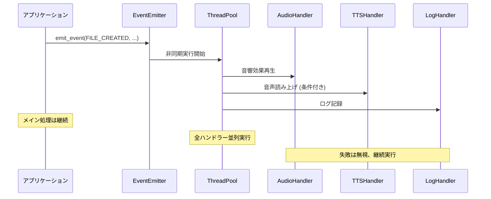

# 🎣 Hooks System 設計書

**最終更新**: 2025-07-05  
**アーキテクチャ**: Event-Driven + Plugin Pattern  
**設計原則**: Non-blocking, Configurable, Extensible

## 🏗️ システム概要

### **コア設計思想**
```yaml
設計原則:
  - Non-blocking: メイン処理を決して阻害しない
  - Fail-safe: フック失敗でもメイン処理は継続
  - Configurable: 実行時設定変更可能
  - Extensible: 新しいフック種類を簡単追加
  - Platform-agnostic: クロスプラットフォーム対応
```

## 📋 アーキテクチャ構成

### **1. イベント駆動アーキテクチャ**
```
┌─────────────────┐    ┌─────────────────┐    ┌─────────────────┐
│   File Ops      │───▶│  Event Emitter  │───▶│  Hook Handlers  │
│ (Create/Modify) │    │  (Non-blocking) │    │  (Audio/Log/TTS)│
└─────────────────┘    └─────────────────┘    └─────────────────┘
         │                       │                       │
         ▼                       ▼                       ▼
┌─────────────────┐    ┌─────────────────┐    ┌─────────────────┐
│  Main Process   │    │  Thread Pool    │    │  External Tools │
│  (Continues)    │    │  (Async Exec)   │    │  (sox/say/etc)  │
└─────────────────┘    └─────────────────┘    └─────────────────┘
```

### **2. プラグインパターン**
```python
# Hook Interface (Plugin Pattern)
class HookHandler:
    def name(self) -> str: pass
    def can_handle(self, event: HookEvent) -> bool: pass
    def handle(self, event: HookEvent) -> None: pass
    def priority(self) -> int: pass  # 実行優先度

# 実装例
handlers = [
    AudioHandler(),     # 音響効果
    TTSHandler(),       # 音声読み上げ
    LogHandler(),       # ログ記録
    NotificationHandler() # デスクトップ通知
]
```

## 🔧 コンポーネント設計

### **Core Components**

#### **1. EventType (列挙型)**
```python
class EventType(Enum):
    FILE_CREATED = "file_created"
    FILE_MODIFIED = "file_modified"  
    FILE_DELETED = "file_deleted"
    FOLDER_CREATED = "folder_created"
    FOLDER_DELETED = "folder_deleted"
    VALIDATION_PASSED = "validation_passed"
    VALIDATION_FAILED = "validation_failed"
    SYSTEM_ACTION = "system_action"
```

#### **2. HookEvent (データ構造)**
```python
@dataclass
class HookEvent:
    event_type: EventType
    path: str
    actor: str              # 実行者
    timestamp: str          # ISO 8601
    details: Dict           # 追加情報
    message: str            # 人間向けメッセージ
```

#### **3. AudioHooksSystem (中央制御)**
```python
class AudioHooksSystem:
    # 非同期イベント処理
    def emit_event(self, event_type, path, details, message)
    
    # 設定管理
    def _load_config(self, config_path)
    
    # ハンドラー管理
    def _process_event(self, event)  # スレッド実行
```

## 🎯 フック種別設計

### **1. Audio Hook (音響効果)**
```python
class AudioHandler:
    目的: ファイル操作の音響フィードバック
    
    音響マッピング:
      FILE_CREATED: gentle_create.wav (800Hz, 0.3s)
      FILE_MODIFIED: soft_modify.wav (600Hz, 0.2s)
      FILE_DELETED: gentle_delete.wav (400Hz, 0.4s)
      VALIDATION_PASSED: success_chime.wav (1000-1200Hz)
      VALIDATION_FAILED: gentle_error.wav (300-200Hz)
    
    技術仕様:
      - SoX による wav 生成
      - プラットフォーム別再生 (afplay/aplay/paplay)
      - ボリューム制御 (0.3 デフォルト)
      - 失敗時サイレント継続
```

### **2. TTS Hook (音声読み上げ)**
```python
class TTSHandler:
    目的: 重要操作の音声通知
    
    読み上げ条件:
      - 重要イベントのみ (VALIDATION_FAILED, FILE_DELETED, SYSTEM_ACTION)
      - レート制限: 1分間10回まで
      - メッセージ長制限: 50文字以内
    
    技術仕様:
      - プラットフォーム自動検出 (say/espeak-ng/spd-say)
      - 記号除去・短縮処理
      - 非同期実行
      - 失敗時サイレント継続
```

### **3. Logging Hook (記録)**
```python
class LogHandler:
    目的: 操作履歴の永続化
    
    ログ分離:
      FILE_OPERATIONS_LOG.md: ファイル操作記録
      AI_INTERACTIONS_LOG.md: AI相互作用記録
    
    記録形式:
      - タイムスタンプ - メッセージ - 詳細 - 実行者
      - Markdown 形式
      - 自動ヘッダー生成
      - 追記モード
```

## ⚙️ 設定システム設計

### **Configuration Schema**
```json
{
  "audio_hooks": {
    "sound_enabled": false,      // 音響効果 ON/OFF
    "tts_enabled": false,        // TTS ON/OFF  
    "logging_enabled": true,     // ログ記録 ON/OFF
    "volume": 0.3,              // 音量 (0.0-1.0)
    "sounds": { ... },          // 音響ファイルマッピング
    "tts_settings": { ... }     // TTS詳細設定
  },
  "file_operations": {
    "track_creates": true,       // 作成追跡
    "track_modifications": true, // 変更追跡
    "track_deletions": true,    // 削除追跡
    "ignore_patterns": [ ... ]  // 除外パターン
  },
  "security": {
    "sandbox_audio_commands": true, // コマンド実行サンドボックス
    "timeout_seconds": 5,           // タイムアウト制限
    "allowed_commands": [ ... ]     // 許可コマンドリスト
  }
}
```

## 🔄 実行フロー

### **イベント発行から処理完了まで**


## 🛡️ セキュリティ設計

### **脅威モデル & 対策**
```yaml
脅威と対策:
  コマンドインジェクション:
    対策: 
      - 許可コマンドリストによる制限
      - subprocess でのシェル実行回避
      - 引数の厳格な検証

  リソース消費攻撃:
    対策:
      - ハンドラー実行タイムアウト (5秒)
      - TTS レート制限 (10回/分)
      - スレッドプール上限設定

  ログインジェクション:
    対策:
      - ログメッセージのサニタイズ
      - ファイルパス検証
      - 構造化ログ形式の強制

  権限昇格:
    対策:
      - 最小権限の原則
      - 外部コマンド実行の制限
      - ファイルシステムアクセス制限
```

## 📈 パフォーマンス設計

### **Non-blocking 保証**
```python
# メイン処理への影響ゼロ設計
def emit_event(self, event_type, path, details):
    # 即座に return、処理は別スレッド
    threading.Thread(
        target=self._process_event, 
        args=(event,), 
        daemon=True  # メインプロセス終了時に自動終了
    ).start()
    # ここで即座に return - メイン処理継続
```

### **リソース最適化**
```yaml
最適化戦略:
  メモリ使用量:
    - イベントオブジェクトの軽量化
    - 音響ファイルのキャッシュ
    - ログローテーション機能

  CPU使用量:
    - 不必要なハンドラーの無効化
    - 条件分岐による早期終了
    - 重複処理の排除

  I/O効率:
    - ログファイルのバッファリング
    - 音響ファイルの事前生成
    - 非同期ファイル操作
```

## 🔌 拡張性設計

### **新しいハンドラー追加**
```python
# 新しいフック種類の追加例
class DesktopNotificationHandler:
    def name(self) -> str:
        return "desktop_notification"
    
    def can_handle(self, event: HookEvent) -> bool:
        return event.event_type in [EventType.VALIDATION_FAILED]
    
    def handle(self, event: HookEvent) -> None:
        # デスクトップ通知実装
        pass

# システムへの登録
hooks_system.register_handler(DesktopNotificationHandler())
```

### **カスタムイベント種類**
```python
# プロジェクト固有のイベント追加
class CustomEventType(Enum):
    DEPLOYMENT_STARTED = "deployment_started"
    TEST_COMPLETED = "test_completed"
    BUILD_FAILED = "build_failed"
```

## 🧪 テスト戦略

### **テスト分類**
```yaml
Unit Tests:
  - 各ハンドラーの独立テスト
  - 設定ローダーのテスト
  - イベント生成のテスト

Integration Tests:
  - エンドツーエンドイベントフロー
  - 外部コマンド実行テスト
  - ファイルシステム統合テスト

Performance Tests:
  - 大量イベント処理性能
  - メモリリーク検証
  - 並行実行安定性

Security Tests:
  - コマンドインジェクション防御
  - ファイルパス検証
  - 権限制限確認
```

## 🔄 運用設計

### **監視・デバッグ**
```python
# デバッグモード
DEBUG_HOOKS = os.environ.get('DEBUG_HOOKS', 'false').lower() == 'true'

if DEBUG_HOOKS:
    print(f"Hook executed: {handler.name()} for {event.path}")
    print(f"Duration: {execution_time:.3f}s")
```

### **設定変更方法**
```bash
# 実行時設定変更
./scripts/toggle-audio-hooks.sh sound on    # 音響効果有効
./scripts/toggle-audio-hooks.sh tts off     # TTS無効
./scripts/toggle-audio-hooks.sh status      # 現在設定表示
```

---

**🎯 この設計により、拡張可能で安全な高性能Hooksシステムを実現**

**⚡ メイン処理への影響ゼロを保証しつつ、豊富なフィードバック機能を提供**