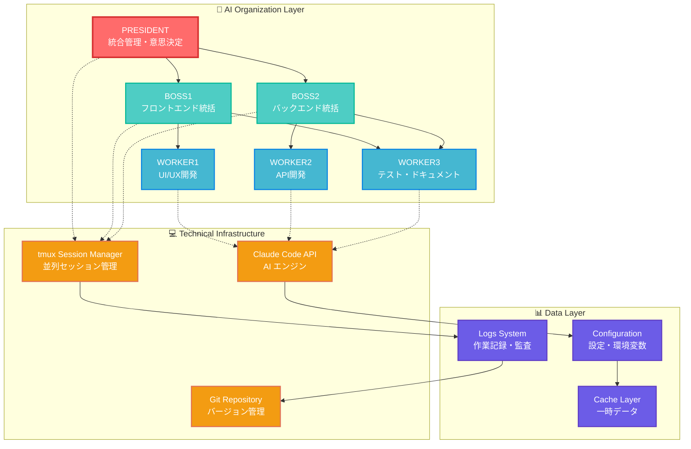
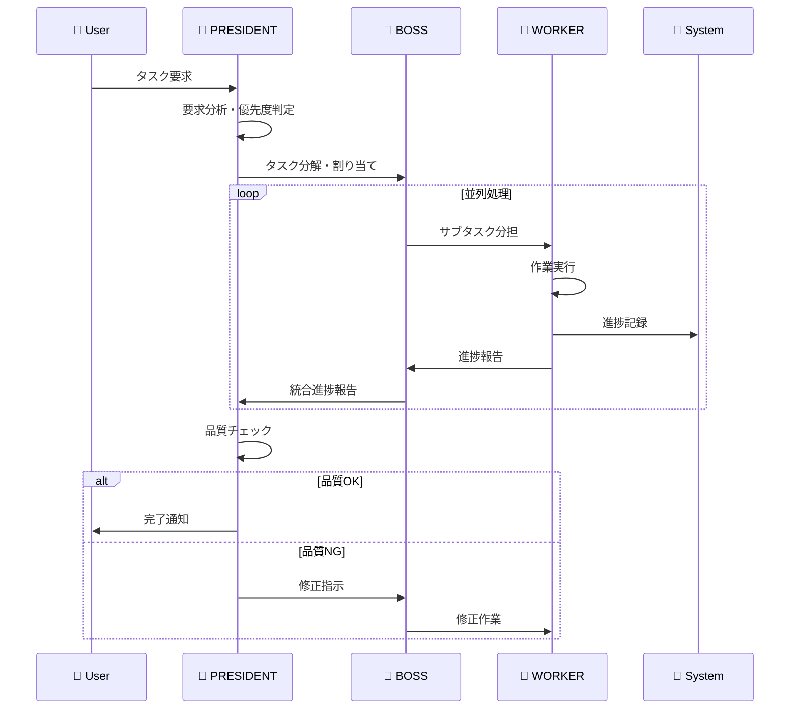
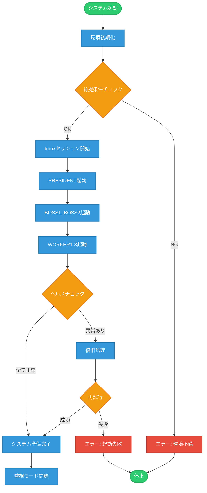
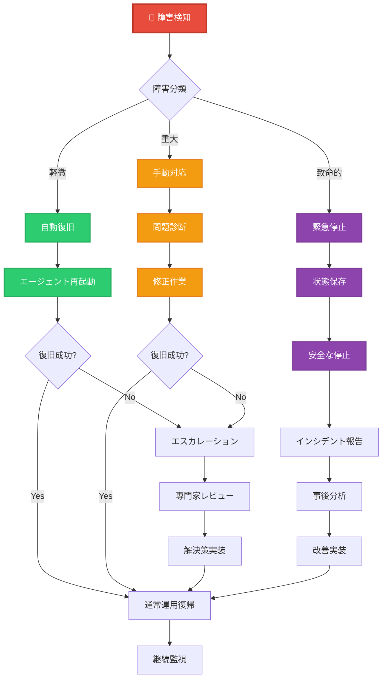
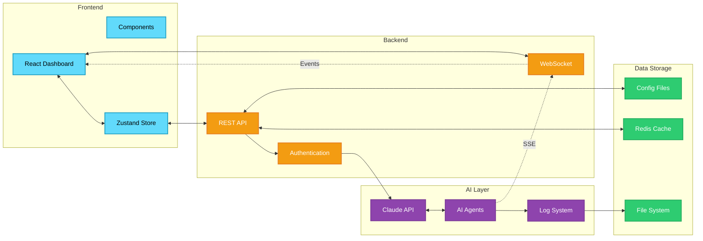
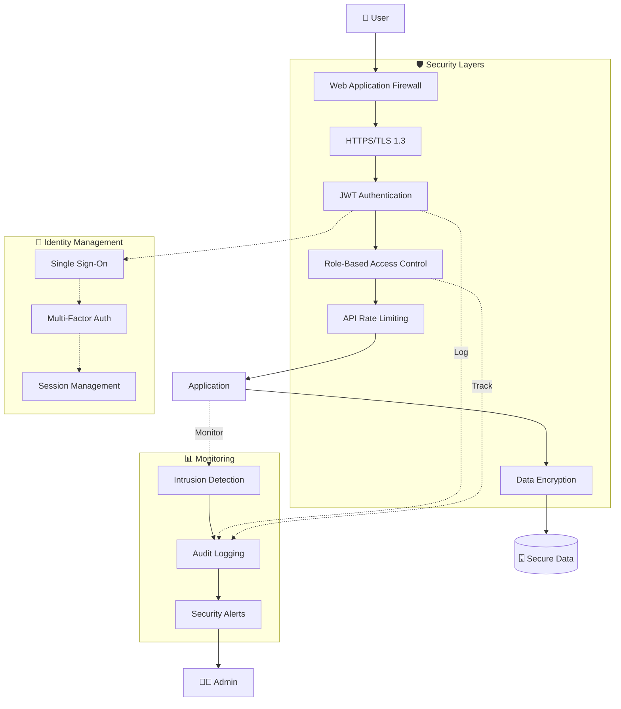

# 🏗️ TeamAI システム構成図・フローチャート集

## 🎯 システム全体アーキテクチャ

### 1. AI組織システム構成図


### 2. タスク処理フロー


## 🔄 プロセスフロー詳細

### 3. システム起動フロー


### 4. 障害対応フロー


## 🎨 UI/UX ワイヤーフレーム

### 5. ダッシュボード画面構成
```
┌─────────────────────────────────────────────────────────────┐
│ 🏠 TeamAI Dashboard                          👤 User  ⚙️    │
├─────────────────────────────────────────────────────────────┤
│ 📊 システム状態                                              │
│ ┌─────────┐ ┌─────────┐ ┌─────────┐ ┌─────────┐          │
│ │🧠 PRES   │ │👔 BOSS1 │ │👔 BOSS2 │ │📈 System│          │
│ │ ●ACTIVE │ │ ●ACTIVE │ │ ●ACTIVE │ │ ●HEALTHY│          │
│ │ CPU:45% │ │ CPU:32% │ │ CPU:28% │ │ MEM:67% │          │
│ └─────────┘ └─────────┘ └─────────┘ └─────────┘          │
├─────────────────────────────────────────────────────────────┤
│ 🔧 ワーカー状態                                              │
│ ┌───────────────┬───────────────┬───────────────┐          │
│ │🎨 WORKER1     │⚙️ WORKER2     │📝 WORKER3     │          │
│ │UI/UX Development│API Development │Documentation  │          │
│ │●ACTIVE        │●ACTIVE        │●ACTIVE        │          │
│ │Progress: 75%  │Progress: 82%  │Progress: 90%  │          │
│ │Current: Design│Current: API   │Current: Testing│          │
│ └───────────────┴───────────────┴───────────────┘          │
├─────────────────────────────────────────────────────────────┤
│ 📋 タスクキュー                    📊 リアルタイムログ       │
│ ┌─────────────────────────────┐ ┌─────────────────────────┐ │
│ │ 🔥 HIGH: Fix critical bug   │ │ [12:34] WORKER1: UI fix │ │
│ │ 📝 MED:  Update docs        │ │ [12:33] BOSS1: Review   │ │
│ │ 🎨 LOW:  Improve design     │ │ [12:32] PRESIDENT: OK   │ │
│ │ ⏳ WAIT: Deploy to staging  │ │ [12:31] WORKER2: API OK │ │
│ └─────────────────────────────┘ └─────────────────────────┘ │
├─────────────────────────────────────────────────────────────┤
│ 🎛️ Quick Actions                                             │
│ [🚀 Start All] [⏸️ Pause] [🔄 Restart] [🛑 Emergency Stop]   │
└─────────────────────────────────────────────────────────────┘
```

### 6. モバイル版レスポンシブデザイン
```
📱 Mobile View (320px-768px)
┌─────────────────────┐
│ 🏠 TeamAI    ☰ Menu │
├─────────────────────┤
│ 📊 システム概要      │
│ ┌─────────────────┐ │
│ │ 🧠 PRESIDENT    │ │
│ │ ● ACTIVE        │ │
│ │ 3/3 エージェント │ │
│ └─────────────────┘ │
├─────────────────────┤
│ 🔧 ワーカー (3/3)   │
│ ┌─────────────────┐ │
│ │ 🎨 UI/UX  75%   │ │
│ │ ⚙️ API    82%   │ │
│ │ 📝 DOC    90%   │ │
│ └─────────────────┘ │
├─────────────────────┤
│ 📋 タスク (4件)     │
│ ┌─────────────────┐ │
│ │ 🔥 Critical Bug │ │
│ │ 📝 Update Docs  │ │
│ │ + 2 more...     │ │
│ └─────────────────┘ │
├─────────────────────┤
│ [🚀] [⏸️] [🔄] [🛑] │
└─────────────────────┘
```

## 🔌 データフロー図

### 7. API データフロー


### 8. セキュリティアーキテクチャ


これらの図表により、TeamAIシステムの全体像が視覚的に理解しやすくなります。各図は目的に応じて詳細レベルを調整し、技術者から経営層まで幅広い読者に対応しています。