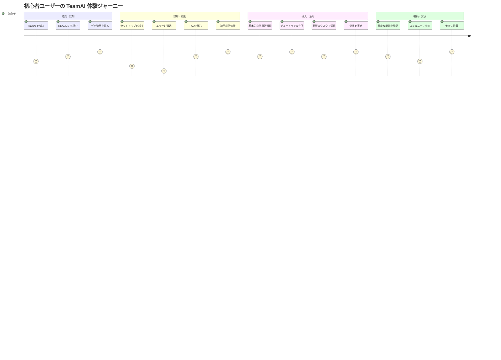
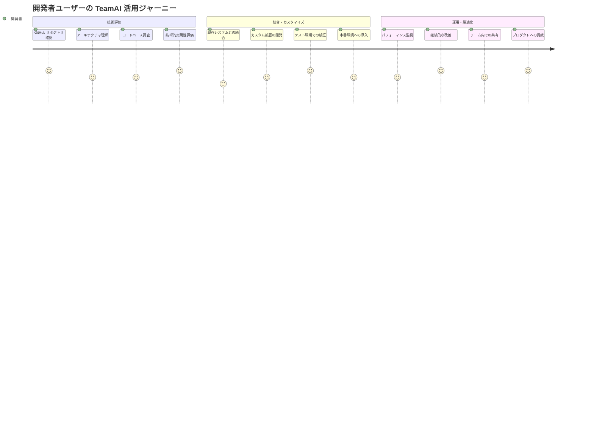
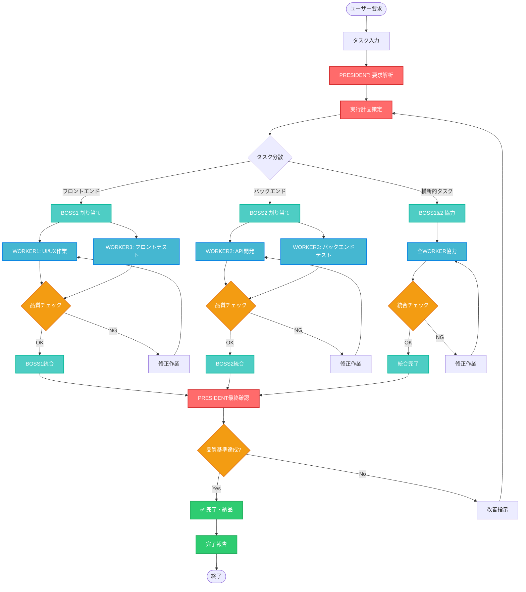
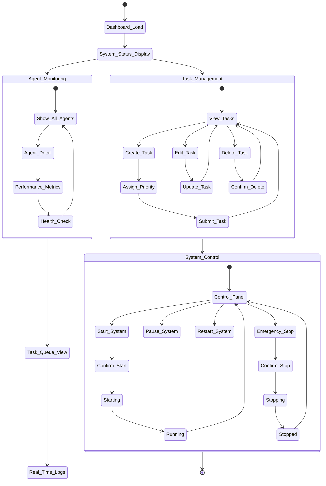
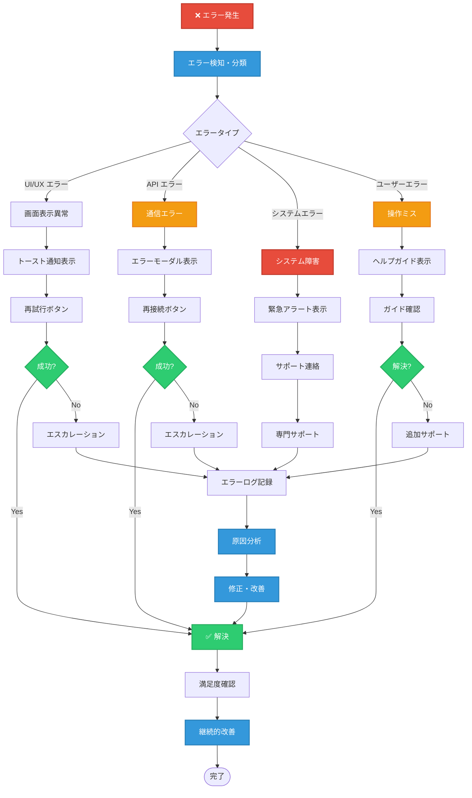
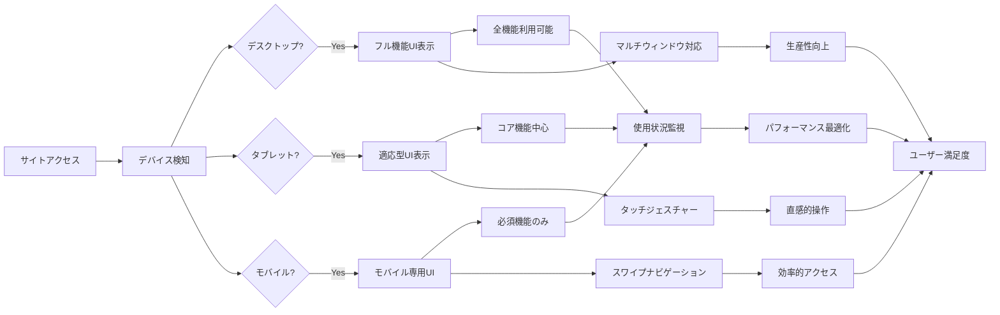
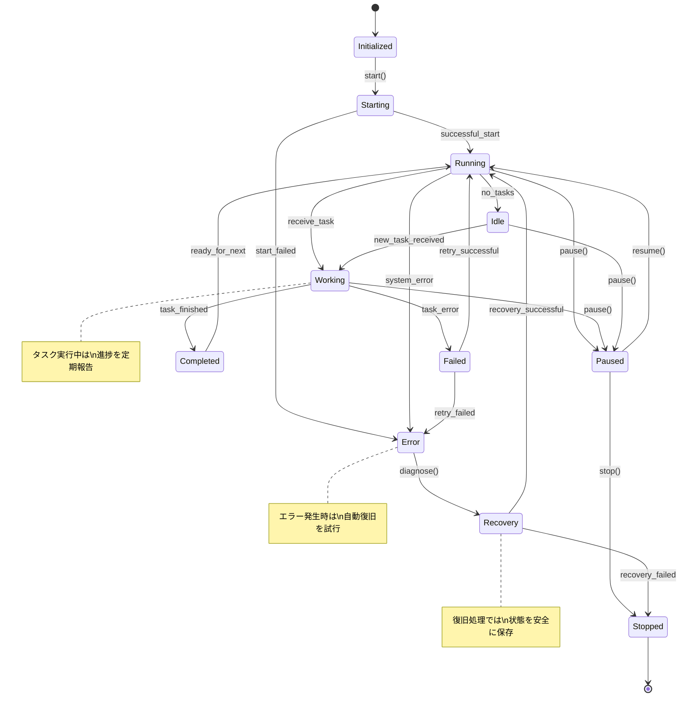

# 🗺️ ユーザージャーニー・フロー図

## 👥 ユーザー別ジャーニーマップ

### 1. 初心者ユーザーのジャーニー

### 2. 開発者ユーザーのジャーニー

## 🔄 タスク実行フロー

### 3. 典型的なタスク処理の流れ

## 🎯 UI/UX インタラクションフロー

### 4. ダッシュボード操作フロー

### 5. エラーハンドリング・フィードバックフロー

## 📱 レスポンシブデザインフロー

### 6. デバイス別適応フロー

## 🔄 システム状態遷移

### 7. AI エージェント状態管理

これらのフローチャートにより、TeamAI システムの動作原理やユーザーエクスペリエンスが明確に可視化され、開発者・運用者・エンドユーザー全員の理解が深まります。