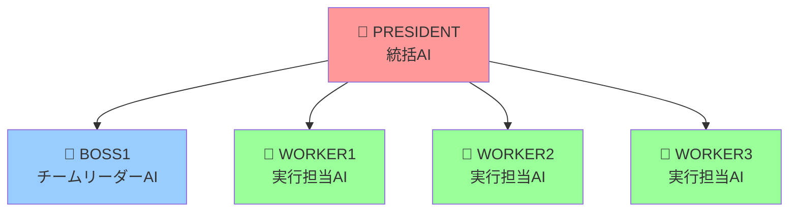

# 🤖 TeamAI - AI 組織開発システム

<div align="center">

**🚀 日本語対応の階層型マルチエージェント AI 組織で開発を革新 🚀**

[](./setup.sh)
[](./docs)
[](./LICENSE)

</div>

---

## 📋 目次

- [🚀 最速セットアップ](#-最速セットアップ2-分)
- [🎯 使い方](#-使い方超簡単)
- [🤖 AI 組織構成](#-ai-組織構成)
- [📦 設定パターン](#-選べる-3-パターン)
- [🔐 認証設定](#-認証設定重要)
- [🎬 実際の使用例](#-実際の使用例)
- [🔧 トラブルシューティング](#-トラブルシューティング)
- [🌟 特徴](#-特徴)

---

## 🚀 **最速セットアップ（2 分）**

<details>
<summary>📋 <strong>クイックスタート（推奨）</strong></summary>

```bash
# 1️⃣ セットアップ実行
./setup.sh

# 2️⃣ 認証設定（重要！）
./setup.sh → a) 認証設定 → Proプラン または API Key を選択

# 3️⃣ AI組織システム起動
./ai-agents/manage.sh claude-auth
```

**🎉 これで完了！** PRESIDENT + 4 つのワーカー AI が自動起動します

</details>

<div align="center">

| ステップ | 操作 | 所要時間 |
|---------|------|----------|
| 1️⃣ | セットアップ実行 | 30秒 |
| 2️⃣ | 認証設定 | 1分 |
| 3️⃣ | AI組織起動 | 30秒 |

</div>

---

## 🎯 **使い方（超簡単）**

### 🔥 **Step 1: AI 組織システム起動**

```bash
./ai-agents/manage.sh claude-auth
```

<div align="center">

| 機能 | 状態 | 説明 |
|------|------|------|
| 認証設定 | ✅ 自動選択 | 設定済み認証を自動検出 |
| PRESIDENT | ✅ 自動起動 | 統括AI が起動 |
| 4 ワーカー | ✅ 自動起動 | 実行担当AI が起動 |
| 日本語対応 | ✅ 完全対応 | 全AIが日本語で対話 |

</div>

### 💬 **Step 2: プロジェクト指示**

**PRESIDENT 画面**でプロジェクトを指示するだけ：

<details>
<summary>💡 <strong>指示例を見る</strong></summary>

```
Hello Worldプロジェクトを作成してください
```

```
Python FlaskでTodoアプリを作成してください。API設計、フロントエンド、テストまで含めて
```

```
CSVファイルを読み込んで可視化するPythonスクリプトを作成してください
```

</details>

### 👀 **Step 3: AI 活動監視**

**ターミナル 2**で 4 つの AI の活動をリアルタイム監視：

```bash
tmux attach-session -t multiagent
```

---

## 🤖 **AI 組織構成**

<div align="center">



</div>

<div align="center">

| 役割 | AI | 機能 | 特徴 |
|------|----|----|------|
| 統括 | 👑 PRESIDENT | プロジェクト全体統括 | 日本語指示対応 |
| 管理 | 👔 BOSS1 | チームリーダー | 作業分担・進捗管理 |
| 実行 | 👷 WORKER1-3 | 実行担当 | ファイル作成・編集・実行 |

</div>

**💪 実際にファイル作成・コード生成・実行を行います！**

---

## 📦 **選べる 3 パターン**

<div align="center">

```bash
./setup.sh
```

</div>

<div align="center">

| パターン | 機能 | 対象 | 推奨度 |
|----------|------|------|--------|
| 🟢 **基本版** | Cursor Rules のみ | 個人開発・初心者 | ⭐⭐⭐ |
| 🟡 **開発版** | Cursor Rules + Claude Code | チーム開発・実務 | ⭐⭐⭐⭐ |
| 🔴 **完全版** | 全機能 + AI組織システム | 高度な開発・研究 | ⭐⭐⭐⭐⭐ |

</div>

<details>
<summary>📋 <strong>各パターンの詳細</strong></summary>

### 🟢 **パターン 1: 基本版**
- ✅ Cursor Rules のみ
- ✅ 軽量で最小限の構成
- ✅ 個人開発・初心者向け

### 🟡 **パターン 2: 開発版**
- ✅ Cursor Rules + Claude Code 連携
- ✅ 開発作業に必要な基本環境
- ✅ チーム開発・実務向け

### 🔴 **パターン 3: 完全版（AI 組織システム）**
- ✅ 全機能 + 5 つの AI エージェント組織
- ✅ **推奨** - 高度な開発・研究
- ✅ マルチエージェント連携

</details>

---

## 🔐 **認証設定（重要）**

<div align="center">

| 認証方法 | 特徴 | 推奨対象 | 設定方法 |
|---------|------|----------|----------|
| 🏆 **claude.ai Pro** | 高性能・安定・月額固定 | **推奨** | `./setup.sh → a) 認証設定 → 1` |
| 🔑 **ANTHROPIC_API_KEY** | 従量課金・開発者向け | テスト用 | `./setup.sh → a) 認証設定 → 2` |

</div>

<details>
<summary>🔧 <strong>認証設定の詳細手順</strong></summary>

### 🏆 **claude.ai Pro プラン（推奨）**

```bash
# 1. 認証設定メニューを開く
./setup.sh → a) 認証設定 → 1) claude.ai Proプラン

# 2. 指示に従ってブラウザでログイン
claude  # コマンド実行後、ブラウザでログイン
```

### 🔑 **ANTHROPIC_API_KEY**

```bash
# 1. API Key取得
# https://console.anthropic.com/ でAPI Key作成

# 2. 環境変数設定
export ANTHROPIC_API_KEY=sk-ant-your-key-here

# 3. 永続化（推奨）
echo 'export ANTHROPIC_API_KEY=sk-ant-your-key-here' >> ~/.zshrc
```

### 🔍 **認証トラブル対応**

```bash
# 認証状況確認
./setup.sh → a) 認証設定 → 3) 現在の設定確認

# 認証競合エラーが出た場合
./setup.sh → a) 認証設定 → 競合解決手順に従う
```

</details>

---

## 🎬 **実際の使用例**

<details>
<summary>🌐 <strong>Web 開発プロジェクト</strong></summary>

**PRESIDENT画面で指示:**
```
Python FlaskでTodoアプリを作成してください。
API設計、フロントエンド、テストまで含めて
```

**期待される成果物:**
- ✅ Flask API サーバー
- ✅ HTML/CSS/JS フロントエンド
- ✅ SQLite データベース
- ✅ ユニットテスト
- ✅ 実行可能な完全なアプリ

</details>

<details>
<summary>📊 <strong>データ分析プロジェクト</strong></summary>

**PRESIDENT画面で指示:**
```
CSVファイルを読み込んで可視化するPythonスクリプトを作成してください
```

**期待される成果物:**
- ✅ CSV読み込み機能
- ✅ データクリーニング
- ✅ 統計分析
- ✅ グラフ・チャート生成
- ✅ HTML レポート出力

</details>

<details>
<summary>🎮 <strong>ゲーム開発プロジェクト</strong></summary>

**PRESIDENT画面で指示:**
```
JavaScript でテトリスゲームを作成してください。
Canvas を使用して、効果音も含めて
```

**期待される成果物:**
- ✅ HTML5 Canvas ゲーム
- ✅ テトリスロジック
- ✅ 効果音・BGM
- ✅ スコアシステム
- ✅ レスポンシブデザイン

</details>

**🤝 AI 同士が日本語で相談しながら、実際にファイルを作成します！**

---

## 🔧 **トラブルシューティング**

<details>
<summary>🔐 <strong>認証エラー</strong></summary>

### 📋 **対処手順**

```bash
# 1️⃣ 認証状況確認
./setup.sh → a) 認証設定 → 3) 現在の設定確認

# 2️⃣ 認証方法選択
./setup.sh → a) 認証設定 → 使いたい方法を選択

# 3️⃣ 競合がある場合
# どちらか一方を無効化する
```

### 🔍 **よくある症状**
- ❌ `Authentication failed`
- ❌ `API key not found`
- ❌ `Login required`

</details>

<details>
<summary>⚠️ <strong>stdin Raw mode エラー</strong></summary>

### 📋 **対処手順**

```bash
# 1️⃣ 自動修正（推奨）
./ai-agents/claude-stdin-fix.sh auto president 0

# 2️⃣ エラー状況確認
./ai-agents/claude-stdin-fix.sh check president 0

# 3️⃣ 手動修正（PTY使用）
./ai-agents/claude-stdin-fix.sh pty president 0
```

### 🔍 **よくある症状**
- ❌ `stdin: raw mode not supported`
- ❌ `TTY not available`

</details>

<details>
<summary>💥 <strong>AI 組織システムが起動しない</strong></summary>

### 📋 **対処手順**

```bash
# 1️⃣ 完全リセット
./ai-agents/manage.sh clean

# 2️⃣ 再起動
./ai-agents/manage.sh claude-auth

# 3️⃣ 状況確認
./ai-agents/manage.sh status
```

### 🔍 **よくある症状**
- ❌ `Session not found`
- ❌ `tmux server not running`
- ❌ `Connection refused`

</details>

<details>
<summary>🔄 <strong>セットアップが途中で止まる</strong></summary>

### 📋 **対処手順**

```bash
# 1️⃣ 権限確認
chmod +x setup.sh
chmod +x ai-agents/manage.sh

# 2️⃣ 依存関係確認
which tmux  # tmux がインストールされているか
which claude  # claude CLI がインストールされているか

# 3️⃣ 強制再実行
./setup.sh  # 再度実行
```

</details>

---

## 🌟 **特徴**

<div align="center">

| 特徴 | 説明 | 効果 |
|------|------|------|
| 🎯 **日本語完全対応** | 全 AI が日本語で対話 | 自然な指示・相談が可能 |
| 🚀 **ワンコマンド起動** | `claude-auth`で全自動 | 複雑な設定不要 |
| 👥 **5 つの AI エージェント** | 階層型組織 | 効率的な作業分担 |
| 🔧 **実際の開発支援** | ファイル作成・編集・実行 | 机上論ではなく実装まで |
| 📱 **3 つの設定パターン** | 用途に応じて選択可能 | 初心者から上級者まで |
| 🔐 **柔軟な認証** | Pro プラン・API Key 両対応 | 利用環境に合わせて選択 |

</div>

---

## 🛠️ **上級者向け機能**

<details>
<summary>🔽 <strong>セッション操作コマンド</strong></summary>

### 📺 **画面確認・操作**

```bash
./ai-agents/manage.sh president          # PRESIDENT画面
./ai-agents/manage.sh multiagent         # 4画面確認
tmux attach-session -t president         # PRESIDENT直接接続
tmux attach-session -t multiagent        # 4画面直接接続
```

### ⚙️ **システム管理**

```bash
./ai-agents/manage.sh clean              # 全セッション削除
./ai-agents/manage.sh status             # システム状況確認
./ai-agents/manage.sh auto               # 旧起動方法（非推奨）
```

</details>

<details>
<summary>🔽 <strong>ファイル構成</strong></summary>

```
team-ai/
├── 📁 cursor-rules/              # AI開発ルール集
│   ├── rules.mdc                 # メインルール
│   ├── todo.mdc                  # タスク管理ルール
│   ├── uiux.mdc                  # UI/UX設計ルール
│   └── dev-rules/                # 開発ルール詳細
├── 📁 ai-agents/                 # AI組織システム
│   ├── instructions/             # エージェント指示書
│   │   ├── president.md          # PRESIDENT指示書
│   │   ├── boss.md               # BOSS指示書
│   │   └── worker.md             # WORKER指示書
│   ├── logs/                     # AI活動ログ
│   ├── sessions/                 # セッション管理
│   └── manage.sh                 # 管理スクリプト
├── 📁 scripts/                   # 補助スクリプト
│   ├── sync-cursor-rules.sh      # ルール同期
│   ├── status-checker.sh         # 状況確認
│   └── claude-cursor-sync.sh     # Cursor連携
├── 📄 setup.sh                   # セットアップスクリプト
├── 📄 README.md                  # 基本説明書
├── 📄 README-improved.md         # 改善版説明書（このファイル）
└── 📄 STATUS.md                  # 設定状況
```

</details>

<details>
<summary>🔽 <strong>参考リンク</strong></summary>

### 🎯 **関連リポジトリ**
- [Claude Code Communication](https://github.com/Akira-Papa/Claude-Code-Communication)

### 📚 **公式ドキュメント**
- [Claude API Documentation](https://docs.anthropic.com/)
- [Cursor Editor](https://cursor.sh/)

</details>

---

<div align="center">

## 🚀 **今すぐ始めよう！**

**たった 3 ステップで、日本語対応 AI 組織システムを体験！**

```bash
./setup.sh
```

---

<div align="center">

[](https://github.com/your-repo)
[](./LICENSE)
[](./CHANGELOG.md)

</div>

---

*Last updated: 2025-06-27 00:50*  
*README improved version - より見やすく、より使いやすく*

</div>