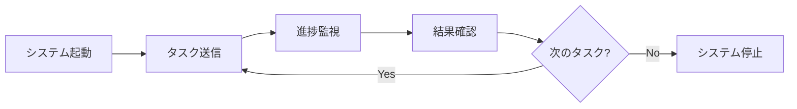

# 📖 TeamAI 基本操作ガイド

このガイドでは、TeamAI AI組織システムの日常的な使用方法を、実際の例とともに詳しく説明します。

## 🎯 基本的な操作フロー

### 1. システム起動 → タスク実行 → 結果確認 → 停止



## 🚀 システム操作

### 基本的な起動・停止
```bash
# 🚀 起動
./scripts/start-ai-organization.sh

# 📊 状態確認  
./scripts/check-status.sh

# ⏸️ 一時停止
./scripts/pause-ai-organization.sh

# ▶️ 再開
./scripts/resume-ai-organization.sh

# 🛑 停止
./scripts/stop-ai-organization.sh
```

### セッション管理
```bash
# tmux セッション一覧
tmux list-sessions

# AI組織セッションに接続
tmux attach-session -t ai-org

# セッション内操作
Ctrl+B, w    # ウィンドウ一覧
Ctrl+B, 0-5  # 各エージェント画面
Ctrl+B, d    # デタッチ（バックグラウンド継続）
```

## 💬 タスクの送信方法

### 1. 対話モード（推奨）
```bash
# 対話型インターフェース開始
./scripts/interactive-mode.sh

# 実際の対話例
TeamAI> ユーザー登録画面を作成してください

🧠 PRESIDENT: 承知いたしました。ユーザー登録画面の作成を承ります。
             要件を詳しく教えていただけますか？

TeamAI> シンプルな形で、名前、メール、パスワードの入力フィールドをお願いします

🧠 PRESIDENT: 了解いたしました。BOSS1にフロントエンド作業を指示いたします。
👔 BOSS1: WORKER1に作業を分担いたします。
🔧 WORKER1: ユーザー登録フォームの作成を開始いたします。

# 進捗確認
TeamAI> 進捗はいかがですか？

🔧 WORKER1: 80%完了しております。あと5分程度で完成予定です。
```

### 2. コマンドライン直接実行
```bash
# 単発タスク
echo "シンプルなTODOアプリを作成してください" | ./scripts/send-task.sh

# ファイルからタスク読み込み
cat tasks/user-registration.txt | ./scripts/send-task.sh

# 複数行タスク
cat << 'EOF' | ./scripts/send-task.sh
Eコマースサイトのトップページを作成してください。
要件:
- レスポンシブデザイン
- 商品カテゴリ一覧
- 検索機能
- ショッピングカート
EOF
```

### 3. API経由でのタスク送信
```bash
# REST API (将来実装)
curl -X POST http://localhost:8000/api/tasks \
  -H "Content-Type: application/json" \
  -d '{"task": "ブログシステムを作成してください", "priority": "high"}'

# WebSocket (リアルタイム)
# 詳細は技術仕様書を参照
```

## 📊 進捗監視・結果確認

### リアルタイム監視
```bash
# メインダッシュボード（ターミナル版）
./scripts/dashboard.sh

# 個別エージェント監視
tail -f logs/ai-agents/worker1/latest.log

# 複数ログの同時監視
multitail \
  logs/ai-agents/president/latest.log \
  logs/ai-agents/boss1/latest.log \
  logs/ai-agents/worker1/latest.log
```

### 進捗確認コマンド
```bash
# 現在のタスク状況
./scripts/task-status.sh

# 出力例:
📋 現在のタスク状況:
🔄 進行中: ユーザー登録画面作成 (WORKER1, 75% 完了)
⏳ 待機中: API仕様書作成 (キューNo.2)
⏳ 待機中: テストケース作成 (キューNo.3)

📊 エージェント状況:
🧠 PRESIDENT: アクティブ (統合管理中)
👔 BOSS1: ビジー (WORKER1監督中)
👔 BOSS2: アイドル (タスク待機中)
🔧 WORKER1: ビジー (UI開発中)
🔧 WORKER2: アイドル (タスク待機中)  
🔧 WORKER3: アイドル (テスト準備中)

# 詳細パフォーマンス
./scripts/performance-stats.sh
```

### 完了通知の確認
```bash
# 最新の完了タスク
./scripts/recent-completions.sh

# 特定タスクの結果
./scripts/get-task-result.sh "ユーザー登録画面作成"

# 生成されたファイルの確認
ls -la output/
cat output/user-registration.html
```

## 🎛️ 高度な操作

### タスクの優先度管理
```bash
# 高優先度タスク
echo "緊急: セキュリティ脆弱性の修正" | ./scripts/send-task.sh --priority=urgent

# 通常優先度（デフォルト）
echo "新機能: ダークモード対応" | ./scripts/send-task.sh --priority=normal

# 低優先度
echo "改善: コードのリファクタリング" | ./scripts/send-task.sh --priority=low

# 優先度付きキューの確認
./scripts/task-queue.sh --sort=priority
```

### タスクの一時停止・キャンセル
```bash
# 進行中タスクの一覧
./scripts/active-tasks.sh

# 特定タスクの一時停止
./scripts/pause-task.sh "ユーザー登録画面作成"

# タスクの再開
./scripts/resume-task.sh "ユーザー登録画面作成"

# タスクのキャンセル（注意: 作業が失われます）
./scripts/cancel-task.sh "ユーザー登録画面作成" --confirm
```

### エージェントの個別制御
```bash
# 特定エージェントの再起動
./scripts/restart-agent.sh worker1

# エージェントの一時停止
./scripts/pause-agent.sh worker2

# エージェントへの直接指示
./scripts/direct-command.sh worker3 "テストケースを5つ作成してください"

# BOSS レベルでの統合指示
./scripts/boss-command.sh boss1 "フロントエンド全体の最適化をお願いします"
```

## 📁 出力ファイルの管理

### 生成されたファイルの確認
```bash
# 最新の出力ファイル一覧
ls -lt output/

# カテゴリ別出力確認
ls output/html/      # HTML ファイル
ls output/css/       # CSS ファイル  
ls output/js/        # JavaScript ファイル
ls output/docs/      # ドキュメント
ls output/tests/     # テストファイル
```

### バージョン管理との統合
```bash
# Git への自動コミット設定
./scripts/configure-auto-commit.sh

# 手動でのコミット
git add output/
git commit -m "TeamAI generated: ユーザー登録画面"

# 変更履歴の確認
git log --oneline --grep="TeamAI generated"
```

## 🔧 設定のカスタマイズ

### 動作設定の調整
```bash
# 設定ファイル編集
nano config/runtime-config.json

# 主要設定項目:
{
  "response_time": {
    "quick_task": 60,      # 簡単なタスク(秒)
    "normal_task": 300,    # 通常タスク(秒)  
    "complex_task": 1800   # 複雑なタスク(秒)
  },
  "auto_actions": {
    "auto_test": true,     # 自動テスト実行
    "auto_format": true,   # 自動コード整形
    "auto_commit": false   # 自動Git コミット
  },
  "quality_control": {
    "review_required": true,     # レビュー必須
    "test_coverage_min": 80,     # テストカバレッジ最低%
    "performance_check": true    # パフォーマンスチェック
  }
}
```

### 通知設定
```bash
# 通知設定の編集
nano config/notifications.json

{
  "completion": {
    "enabled": true,
    "methods": ["terminal", "desktop", "email"]
  },
  "errors": {
    "enabled": true,
    "methods": ["terminal", "desktop"],
    "severity_threshold": "warning"
  },
  "progress": {
    "enabled": true,
    "interval_minutes": 5
  }
}

# 設定の適用
./scripts/reload-config.sh
```

## 🔍 デバッグ・トラブルシューティング

### ログレベル調整
```bash
# デバッグモード有効化
export DEBUG_MODE=true
export LOG_LEVEL=DEBUG

# システム再起動
./scripts/restart-ai-organization.sh

# 詳細ログ確認
tail -f logs/ai-agents/*/debug.log
```

### エラー発生時の対応
```bash
# システム状態の診断
./scripts/diagnose-system.sh

# エージェント健全性チェック
./scripts/health-check.sh --detailed

# 問題のあるエージェントの修復
./scripts/repair-agent.sh [agent_name]

# 緊急時のシステムリセット
./scripts/emergency-reset.sh
```

## 📈 使用例・実践的なタスク

### Web開発タスク
```bash
# フロントエンド開発
echo "Reactコンポーネントでユーザープロフィール画面を作成" | ./scripts/send-task.sh

# バックエンド開発  
echo "REST APIでユーザー認証機能を実装" | ./scripts/send-task.sh

# フルスタック開発
cat << 'EOF' | ./scripts/send-task.sh
ブログ投稿システムを作成してください
- フロントエンド: React + TypeScript
- バックエンド: Node.js + Express  
- データベース: SQLite
- 機能: CRUD操作、認証、投稿一覧・詳細表示
EOF
```

### ドキュメント作成
```bash
# API ドキュメント
echo "OpenAPI 3.0形式でREST API仕様書を作成" | ./scripts/send-task.sh

# ユーザーマニュアル
echo "エンドユーザー向けの操作マニュアルをMarkdownで作成" | ./scripts/send-task.sh

# 技術仕様書
echo "システム構成図とアーキテクチャ仕様書を作成" | ./scripts/send-task.sh
```

### テスト・品質管理
```bash
# 単体テスト
echo "Jest を使用してReactコンポーネントの単体テストを作成" | ./scripts/send-task.sh

# 統合テスト
echo "Cypress を使用してE2Eテストシナリオを作成" | ./scripts/send-task.sh

# パフォーマンステスト
echo "Lighthouse を使用してWebサイトのパフォーマンス分析レポート作成" | ./scripts/send-task.sh
```

---

**💡 ベストプラクティス**

1. **明確な指示**: 具体的で詳細な要件を提供
2. **段階的な依頼**: 大きなタスクは小さく分割  
3. **定期的な確認**: 進捗を適度に監視
4. **品質重視**: 速度より品質を優先
5. **バックアップ**: 重要な成果物は定期的に保存

詳細な活用例は [ユーザーガイド](../user-guides/user-guide.md) をご参照ください！