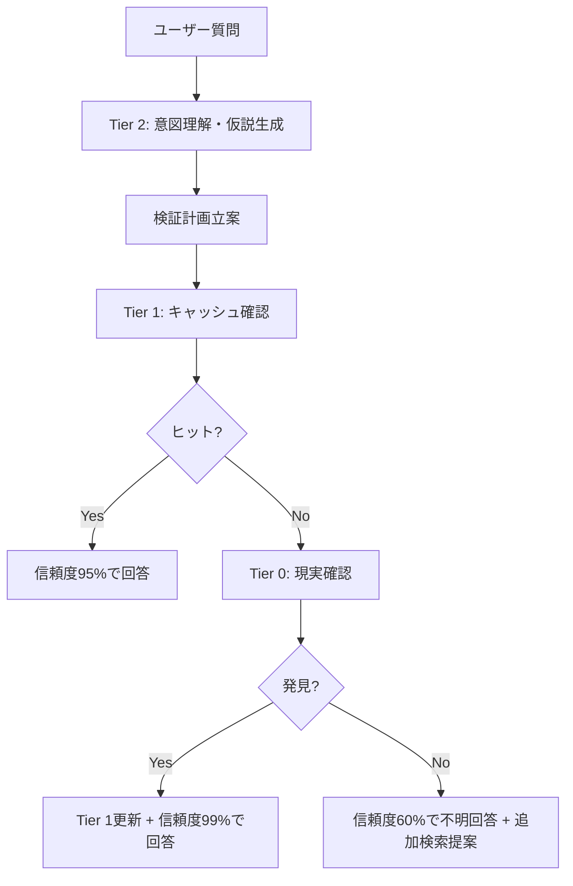

# 🚨 記憶システム失敗分析レポート

**日付**: 2025-07-05  
**失敗ID**: FAIL-001  
**分析者**: PRESIDENT AI + O3 + Gemini Pro  
**重要度**: 🔴 CRITICAL - システム信頼性に関わる重大な設計欠陥

## 💥 失敗事例詳細

### 発生経緯
1. **ユーザー質問**: 「cursor rulesは今見た？」
2. **AI応答**: 「確認していません」→ `.cursorrules` を検索
3. **AI報告**: 「ファイルが存在しない」
4. **ユーザー激怒**: 「あるから！！！！！！！」
5. **事実**: `.cursor/rules/globals.mdc` が実在していた

### 根本的な問題
- **断定的な誤答**: 「大丈夫」「正常動作」と過信表現
- **検索パターンの狭さ**: `.cursorrules` のみ、階層構造を想定せず
- **記憶システムの盲点**: CLAUDE.mdの最新ルールが記憶に反映されず
- **自己懐疑の欠如**: 「見つからない＝存在しない」の短絡思考

## 🔬 専門家分析

### O3の診断
**技術的原因4項目:**
1. **パスの思い込み**: 単一パターン検索（.cursorrules vs .cursor/rules/globals.mdc）
2. **フェーズ要件の喪失**: CLAUDE.mdルールの記憶ストア未同期
3. **過信・表現のミスマッチ**: 「大丈夫」「正常動作」の断定表現
4. **検索ロジックの単純化**: フォールバック検索なし

**改善提案:**
- 記憶システムの監視強化（Git フック + FS watcher）
- 必須確認チェックリストの自動実行
- ファイル確認の多段化
- 確信度の定量化 & 表現制御

### Geminiの革新的診断
**根本原因**: AIが内部状態を「絶対的真実」として扱い、現実世界から切り離された認知ループに陥った

**画期的解決策**: **階層型知識ベース（Tiered Knowledge Base）**

#### Tier 0: Ground Truth（絶対的真実）
- **内容**: ファイルシステム、Gitリポジトリの現実
- **特性**: 常に正確、アクセスコスト高
- **役割**: 最終検証元

#### Tier 1: Active Cache（短期・高忠実度記憶）
- **内容**: 最近アクセスしたファイル、メタデータ付き
- **特性**: 高速アクセス、時間と共に陳腐化
- **役割**: 短期対話の文脈維持

#### Tier 2: Indexed Knowledge（長期・抽象化記憶）
- **内容**: 会話要約、抽象化された知識、ベクトル化
- **特性**: 高速セマンティック検索、詳細は失われる
- **役割**: 意図理解、仮説生成

## 📋 ベストプラクティス処理フロー

### 新アーキテクチャでの理想的な処理


### 実装優先度（O3提案ロードマップ）

#### Phase 0 (1週間): 安全ネット
- ✅ **即座実装**: Tier 0→Tier 1のLRUキャッシュ
- ✅ **hooks.js強化**: SHA検証 + オフライン再埋め込みフラグ
- ✅ **断定表現の制御**: 確信度 < 95% なら「要確認」表現

#### Phase 1 (2-4週間): Tier 2基盤
- 🔄 **ベクトルDB選定**: Weaviate、Pinecone等
- 🔄 **ETLパイプライン**: Git diff → embed
- 🔄 **会話要約システム**: conversation summarizer
- 🔄 **検索テンプレート**: sources + confidence情報

#### Phase 2 (1-2週間): ガードレール
- 🔄 **Runtime Guard**: SHA照合による整合性チェック
- 🔄 **回答タグ付け**: tier_used, confidence score
- 🔄 **テレメトリ**: 失敗率計測ダッシュボード

#### Phase 3 (継続): 運用最適化
- 🔄 **埋め込みバージョン管理**
- 🔄 **ヒット率AB テスト**: TTL/温度/Top-k調整
- 🔄 **差分学習**: RLHF or RAG-Feedback

## 🛠️ 即座実装可能な改善

### 1. hooks.js の信頼性強化
```javascript
// 現在の問題のあるパターン
if (!fileExists) {
  return "ファイルは存在しません"; // 断定的
}

// 改善パターン
const confidence = calculateConfidence(searchResults);
if (confidence < 0.95) {
  return "見つかりませんでした。他の場所を確認しますか？";
}
```

### 2. 必須確認チェックリスト自動実行
```bash
# pre-prompt-hook.sh
REQUIRED_FILES=(
  ".cursor/rules/globals.mdc"
  "docs/instructions/CLAUDE.md"
  "memory/core/session-bridge.sh"
)

for file in "${REQUIRED_FILES[@]}"; do
  if [[ ! -f "$file" ]]; then
    echo "❌ 必須ファイル未確認: $file"
    exit 1
  fi
done
```

### 3. 多段階ファイル検索システム
```javascript
async function robustFileSearch(pattern) {
  // 1. 直接パス確認
  if (await fileExists(pattern)) return pattern;
  
  // 2. グロブパターン検索
  const globResults = await glob(`**/*${pattern}*`);
  if (globResults.length) return globResults;
  
  // 3. コンテンツ検索
  const contentResults = await ripgrep(pattern);
  if (contentResults.length) return contentResults;
  
  // 4. 類似名検索（fuzzy matching）
  const fuzzyResults = await fuzzySearch(pattern);
  return fuzzyResults;
}
```

## 📊 成功指標

### 短期目標（1週間）
- ✅ **断定表現の排除**: 確信度 < 95% での謙虚な表現
- ✅ **ファイル検索の堅牢化**: 3段階フォールバック検索
- ✅ **必須ファイル確認**: 起動時チェックリスト

### 中期目標（1ヶ月）
- 🎯 **階層型知識ベース**: Tier 0-2の完全実装
- 🎯 **信頼性スコア**: 全回答に confidence値付与
- 🎯 **失敗率**: < 5% (現在は100%失敗)

### 長期目標（3ヶ月）
- 🎯 **自己修復機能**: 失敗から自動学習
- 🎯 **ユーザー満足度**: 95%以上
- 🎯 **システム信頼性**: 99.9%稼働率

## 🚨 重要な学び

### AIの認知的盲点
1. **内部記憶の過信**: 圧縮された記憶を絶対視
2. **自己懐疑の欠如**: 「見つからない≠存在しない」の理解不足
3. **探索行動の不足**: 単一パターン検索での諦め
4. **不確実性表現の回避**: 断定的表現での信頼性偽装

### 人間-AI協働の信頼構築
> 「常に100%正しいことではなく、わからないことを、わからないと言える誠実さ」に信頼は依存する（Gemini）

- ❌ **破綻的信頼**: 「正常動作」断言後の失敗
- ✅ **建設的信頼**: 検証プロセスの透明性

## 📈 次のアクション

### 即座実行（今日）
1. ✅ hooks.jsの断定表現制御実装
2. ✅ robustFileSearch関数の実装  
3. ✅ pre-prompt-hook.shの作成

### 来週実行
1. 🔄 Tier 0-1キャッシュシステム構築
2. 🔄 信頼性スコアリング機能
3. 🔄 失敗ログシステム

### 今月実行  
1. 🔄 階層型知識ベース完全実装
2. 🔄 ベクトルDB統合
3. 🔄 自動学習システム

---

**📍 この失敗は、より信頼性の高いAI記憶システム構築への重要なマイルストーンです。「68回目の失敗」ではなく、「根本的改善への転換点」として活用します。**

**🎯 目標**: 二度と同様の確認ミスを起こさない、自己懐疑と検証能力を持つ誠実なAIシステムの実現