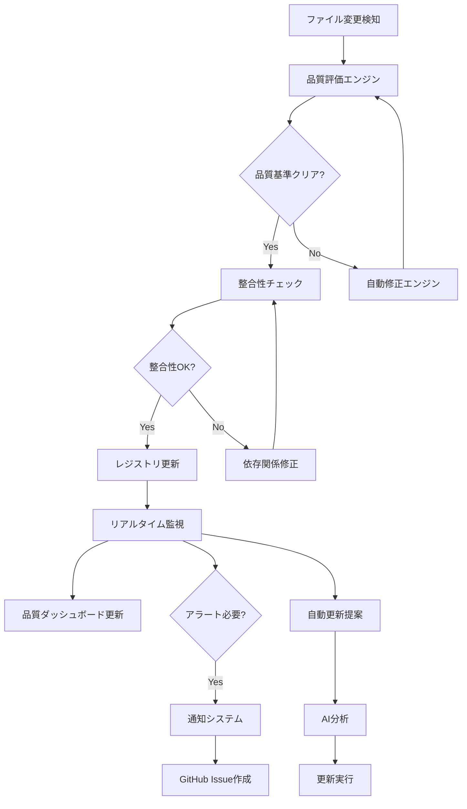

# 次世代品質保証自動化システム v1.0

## 🚀 システム概要
**革新的ドキュメント品質保証・自動化システム**

### 設計理念
1. **完全自動化**: 人的介入を最小限に抑えた自律システム
2. **リアルタイム監視**: 24/7連続監視による即座対応
3. **予測的品質管理**: AI による品質劣化予測・事前対策
4. **自己進化**: システム自身が学習・改善する仕組み

## 🎯 システム構成

### Core System 1: 登録docsファイル定期確認システム

#### 1.1 ファイル登録・監視システム
```json
{
  "document_registry": {
    "file_tracking": {
      "scan_interval": "10分",
      "monitored_paths": [
        "docs/standards/",
        "docs/management/", 
        "docs/getting-started/",
        "docs/user-guides/",
        "ai-agents/docs/"
      ],
      "file_types": [".md", ".json", ".yaml"],
      "exclusions": ["temp/", "archive/", "node_modules/"]
    },
    "registration_criteria": {
      "min_size": "100 bytes",
      "required_metadata": ["title", "version", "author"],
      "naming_compliance": "100%",
      "structure_validation": "enabled"
    }
  }
}
```

#### 1.2 自動ファイル検出・登録
```bash
#!/bin/bash
# auto-doc-registry.sh

# ドキュメント自動検出・登録システム
REGISTRY_DB="/configs/document-registry.json"
SCAN_PATHS=("docs/" "ai-agents/docs/")

detect_new_documents() {
    local new_docs=()
    
    for path in "${SCAN_PATHS[@]}"; do
        while IFS= read -r -d '' file; do
            if [[ ! $(jq -r ".registered_files[] | select(.path == \"$file\")" "$REGISTRY_DB") ]]; then
                new_docs+=("$file")
            fi
        done < <(find "$path" -name "*.md" -type f -print0)
    done
    
    echo "${new_docs[@]}"
}

register_document() {
    local file_path="$1"
    local metadata=$(extract_metadata "$file_path")
    
    # ドキュメント品質検証
    if validate_document_quality "$file_path"; then
        # レジストリに登録
        jq ".registered_files += [{
            \"path\": \"$file_path\",
            \"registered_at\": \"$(date -u +%Y-%m-%dT%H:%M:%SZ)\",
            \"metadata\": $metadata,
            \"quality_score\": $(calculate_quality_score "$file_path"),
            \"checksum\": \"$(md5sum "$file_path" | cut -d' ' -f1)\"
        }]" "$REGISTRY_DB" > "${REGISTRY_DB}.tmp" && mv "${REGISTRY_DB}.tmp" "$REGISTRY_DB"
        
        echo "✅ 登録完了: $file_path"
    else
        echo "❌ 品質基準未達: $file_path"
    fi
}
```

#### 1.3 定期確認・更新検出
```python
#!/usr/bin/env python3
# document_monitor.py

import json
import hashlib
import time
from datetime import datetime
from pathlib import Path

class DocumentMonitor:
    def __init__(self, registry_path="configs/document-registry.json"):
        self.registry_path = Path(registry_path)
        self.registry = self.load_registry()
        
    def monitor_documents(self):
        """登録ドキュメントの変更監視"""
        changes_detected = []
        
        for doc in self.registry['registered_files']:
            file_path = Path(doc['path'])
            
            if not file_path.exists():
                changes_detected.append({
                    'type': 'deleted',
                    'path': str(file_path),
                    'timestamp': datetime.utcnow().isoformat()
                })
                continue
                
            current_checksum = self.calculate_checksum(file_path)
            if current_checksum != doc['checksum']:
                changes_detected.append({
                    'type': 'modified',
                    'path': str(file_path),
                    'old_checksum': doc['checksum'],
                    'new_checksum': current_checksum,
                    'timestamp': datetime.utcnow().isoformat()
                })
                
                # 自動品質チェック実行
                self.auto_quality_check(file_path)
                
        return changes_detected
        
    def auto_quality_check(self, file_path):
        """変更検出時の自動品質チェック"""
        quality_score = self.calculate_quality_score(file_path)
        
        if quality_score < 85:
            self.create_quality_alert(file_path, quality_score)
        
        # レジストリ更新
        self.update_registry_entry(file_path, quality_score)
```

### Core System 2: 品質保証自動化システム

#### 2.1 AI品質評価エンジン
```python
#!/usr/bin/env python3
# ai_quality_evaluator.py

import re
import yaml
from typing import Dict, List, Tuple

class AIQualityEvaluator:
    def __init__(self):
        self.quality_criteria = self.load_quality_criteria()
        
    def evaluate_document(self, file_path: str) -> Dict:
        """AI による包括的品質評価"""
        content = self.read_file(file_path)
        
        evaluation = {
            'structure_score': self.evaluate_structure(content),
            'content_score': self.evaluate_content(content),
            'consistency_score': self.evaluate_consistency(content),
            'completeness_score': self.evaluate_completeness(content),
            'readability_score': self.evaluate_readability(content),
            'metadata_score': self.evaluate_metadata(content)
        }
        
        # 総合スコア計算（加重平均）
        weights = {
            'structure_score': 0.20,
            'content_score': 0.25,
            'consistency_score': 0.15,
            'completeness_score': 0.20,
            'readability_score': 0.10,
            'metadata_score': 0.10
        }
        
        total_score = sum(evaluation[key] * weights[key] for key in weights)
        evaluation['total_score'] = round(total_score, 2)
        
        return evaluation
        
    def evaluate_structure(self, content: str) -> float:
        """文書構造の評価"""
        score = 100.0
        
        # ヘッダー構造チェック
        headers = re.findall(r'^#+\s+(.+)$', content, re.MULTILINE)
        if len(headers) < 3:
            score -= 20
            
        # 目次の存在チェック
        if not re.search(r'##\s+(目次|Contents|TOC)', content):
            score -= 15
            
        # セクション分割の適切性
        sections = content.split('\n##')
        if len(sections) < 2:
            score -= 25
            
        return max(0, score)
        
    def evaluate_content(self, content: str) -> float:
        """内容の質の評価"""
        score = 100.0
        word_count = len(content.split())
        
        # 文書長の適切性
        if word_count < 200:
            score -= 30
        elif word_count > 5000:
            score -= 10
            
        # 例・具体例の存在
        examples = len(re.findall(r'(例|Example|例：|```)', content))
        if examples < 2:
            score -= 20
            
        # チェックリストの存在
        checklists = len(re.findall(r'- \[[ x]\]', content))
        if checklists > 0:
            score += 10
            
        return min(100, max(0, score))
        
    def evaluate_consistency(self, content: str) -> float:
        """一貫性の評価"""
        score = 100.0
        
        # 日付フォーマットの一貫性
        date_formats = set(re.findall(r'\d{4}[-/]\d{1,2}[-/]\d{1,2}', content))
        if len(date_formats) > 1:
            score -= 15
            
        # 用語の一貫性（同義語の混在チェック）
        inconsistencies = self.check_terminology_consistency(content)
        score -= len(inconsistencies) * 5
        
        return max(0, score)
```

#### 2.2 自動修正エンジン
```python
#!/usr/bin/env python3
# auto_correction_engine.py

class AutoCorrectionEngine:
    def __init__(self):
        self.correction_rules = self.load_correction_rules()
        
    def auto_fix_document(self, file_path: str) -> Dict:
        """ドキュメントの自動修正"""
        content = self.read_file(file_path)
        original_content = content
        corrections = []
        
        # 1. 命名規則の自動修正
        content, naming_fixes = self.fix_naming_conventions(content)
        corrections.extend(naming_fixes)
        
        # 2. フォーマットの自動修正
        content, format_fixes = self.fix_formatting(content)
        corrections.extend(format_fixes)
        
        # 3. メタデータの自動補完
        content, metadata_fixes = self.fix_metadata(content, file_path)
        corrections.extend(metadata_fixes)
        
        # 4. 相互参照の自動修正
        content, reference_fixes = self.fix_references(content)
        corrections.extend(reference_fixes)
        
        # 修正内容を保存
        if content != original_content:
            self.backup_file(file_path)
            self.write_file(file_path, content)
            
        return {
            'corrections_applied': len(corrections),
            'corrections': corrections,
            'backup_created': content != original_content
        }
        
    def fix_naming_conventions(self, content: str) -> Tuple[str, List]:
        """命名規則の自動修正"""
        fixes = []
        
        # ファイル名参照の修正
        old_pattern = r'([a-z]+)[-_]([a-z]+)\.md'
        new_pattern = lambda m: f"{m.group(1).upper()}_{m.group(2).upper()}.md"
        
        if re.search(old_pattern, content):
            content = re.sub(old_pattern, new_pattern, content)
            fixes.append("ファイル名参照の命名規則を修正")
            
        return content, fixes
        
    def fix_formatting(self, content: str) -> Tuple[str, List]:
        """フォーマットの自動修正"""
        fixes = []
        
        # 日付フォーマットの統一
        content = re.sub(r'\d{4}/\d{1,2}/\d{1,2}', 
                        lambda m: m.group().replace('/', '-'), content)
        fixes.append("日付フォーマットを統一")
        
        # 見出しレベルの修正
        lines = content.split('\n')
        corrected_lines = []
        
        for line in lines:
            if re.match(r'^#+', line):
                # 見出しレベルの適切化
                level = len(re.match(r'^#+', line).group())
                if level > 4:  # 5階層以上は4階層に修正
                    line = '####' + line[level:]
                    fixes.append(f"見出しレベルを4階層以下に修正")
            corrected_lines.append(line)
            
        content = '\n'.join(corrected_lines)
        return content, fixes
```

### Core System 3: ドキュメント整合性監視システム

#### 3.1 リアルタイム整合性チェック
```javascript
// realtime_consistency_monitor.js

class ConsistencyMonitor {
    constructor() {
        this.watchPaths = ['docs/', 'ai-agents/docs/'];
        this.checkInterval = 60000; // 1分間隔
        this.consistencyRules = this.loadConsistencyRules();
    }
    
    startMonitoring() {
        console.log('🔍 ドキュメント整合性監視開始');
        
        // ファイル変更監視
        this.watchPaths.forEach(path => {
            fs.watch(path, { recursive: true }, (eventType, filename) => {
                if (filename && filename.endsWith('.md')) {
                    this.checkFileConsistency(path + filename);
                }
            });
        });
        
        // 定期全体チェック
        setInterval(() => {
            this.performFullConsistencyCheck();
        }, this.checkInterval);
    }
    
    checkFileConsistency(filePath) {
        const content = fs.readFileSync(filePath, 'utf8');
        const issues = [];
        
        // 相互参照の整合性チェック
        const references = this.extractReferences(content);
        references.forEach(ref => {
            if (!this.validateReference(ref)) {
                issues.push({
                    type: 'broken_reference',
                    reference: ref,
                    severity: 'high'
                });
            }
        });
        
        // バージョン整合性チェック
        const version = this.extractVersion(content);
        if (!this.validateVersionConsistency(filePath, version)) {
            issues.push({
                type: 'version_inconsistency',
                expected: this.getExpectedVersion(filePath),
                actual: version,
                severity: 'medium'
            });
        }
        
        // 依存関係整合性チェック
        const dependencies = this.extractDependencies(content);
        dependencies.forEach(dep => {
            if (!this.validateDependency(dep)) {
                issues.push({
                    type: 'dependency_issue',
                    dependency: dep,
                    severity: 'high'
                });
            }
        });
        
        if (issues.length > 0) {
            this.reportInconsistencies(filePath, issues);
            this.triggerAutoFix(filePath, issues);
        }
    }
    
    performFullConsistencyCheck() {
        console.log('🔄 全体整合性チェック実行中...');
        
        const allDocs = this.getAllDocuments();
        const globalIssues = [];
        
        // 名前空間の重複チェック
        const namespaceConflicts = this.checkNamespaceConflicts(allDocs);
        globalIssues.push(...namespaceConflicts);
        
        // 循環参照チェック
        const circularReferences = this.checkCircularReferences(allDocs);
        globalIssues.push(...circularReferences);
        
        // 構造整合性チェック
        const structureIssues = this.checkStructureConsistency(allDocs);
        globalIssues.push(...structureIssues);
        
        if (globalIssues.length > 0) {
            this.generateConsistencyReport(globalIssues);
        }
    }
}
```

#### 3.2 依存関係管理システム
```yaml
# dependency_mapping.yaml
document_dependencies:
  "docs/standards/MASTER_MANAGEMENT_SYSTEM.md":
    depends_on:
      - "docs/standards/FILE_PLACEMENT_RULES.md"
      - "docs/standards/NAMING_CONVENTIONS.md"
      - "docs/standards/DIRECTORY_OPTIMIZATION_RULES.md"
      - "docs/standards/CONTINUOUS_MAINTENANCE_SYSTEM.md"
    version_constraints:
      - ">=v2.0"
    update_triggers:
      - "dependency_change"
      - "weekly_review"
      
  "docs/standards/FILE_MIGRATION_EXECUTION_PLAN.md":
    depends_on:
      - "docs/standards/FILE_PLACEMENT_RULES.md"
      - "docs/standards/DIRECTORY_OPTIMIZATION_RULES.md"
    auto_update: true
    validation_required: true
    
consistency_rules:
  version_sync:
    - pattern: "docs/standards/*.md"
      require_version: "v2.0+"
      sync_frequency: "daily"
      
  reference_validation:
    - check_internal_links: true
      check_external_dependencies: true
      auto_fix_broken_links: true
      
  naming_consistency:
    - enforce_naming_convention: true
      auto_rename_files: false
      create_migration_plan: true
```

### Core System 4: 品質監視リアルタイムシステム

#### 4.1 ライブ品質ダッシュボード
```html
<!-- quality_dashboard.html -->
<!DOCTYPE html>
<html>
<head>
    <title>リアルタイム品質ダッシュボード</title>
    <script src="https://cdn.jsdelivr.net/npm/chart.js"></script>
    <style>
        .dashboard { display: grid; grid-template-columns: 1fr 1fr; gap: 20px; }
        .metric-card { border: 1px solid #ddd; padding: 20px; border-radius: 8px; }
        .status-good { background-color: #d4edda; }
        .status-warning { background-color: #fff3cd; }
        .status-danger { background-color: #f8d7da; }
    </style>
</head>
<body>
    <h1>🎯 リアルタイム品質ダッシュボード</h1>
    
    <div class="dashboard">
        <div class="metric-card" id="overall-quality">
            <h3>総合品質スコア</h3>
            <div class="score" id="total-score">--</div>
            <canvas id="quality-trend"></canvas>
        </div>
        
        <div class="metric-card" id="document-health">
            <h3>ドキュメント健全性</h3>
            <div>登録ファイル数: <span id="registered-files">--</span></div>
            <div>整合性エラー: <span id="consistency-errors">--</span></div>
            <div>最終チェック: <span id="last-check">--</span></div>
        </div>
        
        <div class="metric-card" id="automation-status">
            <h3>自動化システム状況</h3>
            <div>監視アクティブ: <span id="monitoring-active">--</span></div>
            <div>自動修正実行: <span id="auto-fixes">--</span></div>
            <div>アラート件数: <span id="alert-count">--</span></div>
        </div>
        
        <div class="metric-card" id="recent-activities">
            <h3>最近のアクティビティ</h3>
            <ul id="activity-list">
                <!-- 動的に更新 -->
            </ul>
        </div>
    </div>

    <script>
        class QualityDashboard {
            constructor() {
                this.updateInterval = 30000; // 30秒間隔
                this.startRealTimeUpdates();
            }
            
            async fetchQualityMetrics() {
                try {
                    const response = await fetch('/api/quality-metrics');
                    return await response.json();
                } catch (error) {
                    console.error('品質メトリクス取得エラー:', error);
                    return null;
                }
            }
            
            updateDashboard(metrics) {
                if (!metrics) return;
                
                // 総合品質スコア更新
                document.getElementById('total-score').textContent = 
                    `${metrics.totalScore}/100`;
                    
                // ドキュメント健全性更新
                document.getElementById('registered-files').textContent = 
                    metrics.registeredFiles;
                document.getElementById('consistency-errors').textContent = 
                    metrics.consistencyErrors;
                document.getElementById('last-check').textContent = 
                    new Date(metrics.lastCheck).toLocaleString();
                    
                // 自動化システム状況更新
                document.getElementById('monitoring-active').textContent = 
                    metrics.monitoringActive ? '✅ アクティブ' : '❌ 停止';
                document.getElementById('auto-fixes').textContent = 
                    metrics.autoFixesCount;
                document.getElementById('alert-count').textContent = 
                    metrics.alertCount;
                    
                // アクティビティリスト更新
                this.updateActivityList(metrics.recentActivities);
                
                // 品質トレンドチャート更新
                this.updateQualityChart(metrics.qualityTrend);
            }
            
            startRealTimeUpdates() {
                // 初回読み込み
                this.fetchQualityMetrics().then(metrics => {
                    this.updateDashboard(metrics);
                });
                
                // 定期更新
                setInterval(async () => {
                    const metrics = await this.fetchQualityMetrics();
                    this.updateDashboard(metrics);
                }, this.updateInterval);
            }
        }
        
        // ダッシュボード初期化
        new QualityDashboard();
    </script>
</body>
</html>
```

#### 4.2 アラート・通知システム
```python
#!/usr/bin/env python3
# alert_notification_system.py

import smtplib
import requests
import json
from datetime import datetime
from typing import Dict, List
from email.mime.text import MIMEText
from email.mime.multipart import MIMEMultipart

class AlertNotificationSystem:
    def __init__(self, config_path="configs/notification-config.json"):
        self.config = self.load_config(config_path)
        self.alert_levels = {
            'critical': {'priority': 1, 'color': '#dc3545'},
            'high': {'priority': 2, 'color': '#fd7e14'},
            'medium': {'priority': 3, 'color': '#ffc107'},
            'low': {'priority': 4, 'color': '#28a745'}
        }
        
    def create_alert(self, alert_type: str, level: str, message: str, 
                    details: Dict = None) -> Dict:
        """アラートを作成し通知を送信"""
        alert = {
            'id': self.generate_alert_id(),
            'type': alert_type,
            'level': level,
            'message': message,
            'details': details or {},
            'timestamp': datetime.utcnow().isoformat(),
            'status': 'active'
        }
        
        # アラートを保存
        self.save_alert(alert)
        
        # 通知送信
        self.send_notifications(alert)
        
        return alert
        
    def send_notifications(self, alert: Dict):
        """複数チャネルでの通知送信"""
        level_config = self.config['notification_rules'][alert['level']]
        
        # Slack通知
        if level_config.get('slack', False):
            self.send_slack_notification(alert)
            
        # メール通知
        if level_config.get('email', False):
            self.send_email_notification(alert)
            
        # GitHub Issue作成
        if level_config.get('github_issue', False) and alert['level'] in ['critical', 'high']:
            self.create_github_issue(alert)
            
        # システムログ
        self.log_alert(alert)
        
    def send_slack_notification(self, alert: Dict):
        """Slack通知送信"""
        webhook_url = self.config['slack']['webhook_url']
        
        color = self.alert_levels[alert['level']]['color']
        message = {
            "attachments": [{
                "color": color,
                "title": f"🚨 品質アラート - {alert['level'].upper()}",
                "text": alert['message'],
                "fields": [
                    {"title": "タイプ", "value": alert['type'], "short": True},
                    {"title": "時刻", "value": alert['timestamp'], "short": True}
                ],
                "footer": "品質保証システム",
                "ts": int(datetime.now().timestamp())
            }]
        }
        
        if alert['details']:
            message["attachments"][0]["fields"].append({
                "title": "詳細",
                "value": json.dumps(alert['details'], indent=2),
                "short": False
            })
            
        try:
            response = requests.post(webhook_url, json=message)
            response.raise_for_status()
        except requests.RequestException as e:
            print(f"Slack通知エラー: {e}")
            
    def create_github_issue(self, alert: Dict):
        """GitHub Issue自動作成"""
        github_config = self.config['github']
        
        issue_body = f"""
## 🚨 品質アラート - {alert['level'].upper()}

**タイプ**: {alert['type']}
**発生時刻**: {alert['timestamp']}

### 詳細
{alert['message']}

### 追加情報
```json
{json.dumps(alert['details'], indent=2)}
```

### 推奨アクション
{self.get_recommended_actions(alert)}

---
*このIssueは品質保証システムにより自動生成されました*
        """
        
        issue_data = {
            "title": f"[品質アラート] {alert['type']} - {alert['level']}",
            "body": issue_body,
            "labels": ["quality-alert", f"priority-{alert['level']}"]
        }
        
        try:
            response = requests.post(
                f"https://api.github.com/repos/{github_config['repo']}/issues",
                headers={
                    "Authorization": f"token {github_config['token']}",
                    "Accept": "application/vnd.github.v3+json"
                },
                json=issue_data
            )
            response.raise_for_status()
        except requests.RequestException as e:
            print(f"GitHub Issue作成エラー: {e}")
```

### Core System 5: 自動更新革新システム

#### 5.1 スマート自動更新エンジン
```python
#!/usr/bin/env python3
# smart_auto_update_engine.py

class SmartAutoUpdateEngine:
    def __init__(self):
        self.update_strategies = {
            'conservative': {'auto_apply': False, 'require_approval': True},
            'moderate': {'auto_apply': True, 'require_approval': False, 'backup': True},
            'aggressive': {'auto_apply': True, 'require_approval': False, 'backup': False}
        }
        self.ai_confidence_threshold = 0.85
        
    def analyze_update_needs(self) -> List[Dict]:
        """更新が必要な項目の分析"""
        update_candidates = []
        
        # 1. 依存関係の変更による更新
        dependency_updates = self.check_dependency_updates()
        update_candidates.extend(dependency_updates)
        
        # 2. 品質基準の変更による更新
        quality_updates = self.check_quality_standard_updates()
        update_candidates.extend(quality_updates)
        
        # 3. 構造変更による更新
        structure_updates = self.check_structure_updates()
        update_candidates.extend(structure_updates)
        
        # 4. AI による改善提案
        ai_suggestions = self.get_ai_improvement_suggestions()
        update_candidates.extend(ai_suggestions)
        
        return self.prioritize_updates(update_candidates)
        
    def execute_smart_update(self, update_item: Dict) -> Dict:
        """スマート自動更新の実行"""
        confidence = update_item.get('confidence', 0.0)
        strategy = self.determine_update_strategy(update_item)
        
        result = {
            'update_id': update_item['id'],
            'strategy': strategy,
            'confidence': confidence,
            'status': 'pending'
        }
        
        try:
            if strategy['auto_apply'] and confidence >= self.ai_confidence_threshold:
                # 自動適用
                if strategy['backup']:
                    self.create_backup(update_item['target_file'])
                    
                changes = self.apply_update(update_item)
                result.update({
                    'status': 'applied',
                    'changes': changes,
                    'applied_at': datetime.utcnow().isoformat()
                })
                
                # 適用後検証
                validation_result = self.validate_update(update_item['target_file'])
                if not validation_result['success']:
                    # 検証失敗時のロールバック
                    self.rollback_update(update_item)
                    result['status'] = 'rolled_back'
                    result['rollback_reason'] = validation_result['error']
                    
            else:
                # 承認待ちキューに追加
                self.add_to_approval_queue(update_item)
                result['status'] = 'pending_approval'
                
        except Exception as e:
            result.update({
                'status': 'failed',
                'error': str(e)
            })
            
        return result
        
    def get_ai_improvement_suggestions(self) -> List[Dict]:
        """AI による改善提案生成"""
        suggestions = []
        
        # 全ドキュメントを分析
        all_docs = self.get_all_documents()
        
        for doc_path in all_docs:
            content = self.read_file(doc_path)
            
            # AI分析による改善提案
            ai_analysis = self.analyze_with_ai(content, doc_path)
            
            for suggestion in ai_analysis['suggestions']:
                if suggestion['confidence'] > 0.7:
                    suggestions.append({
                        'id': self.generate_id(),
                        'type': 'ai_suggestion',
                        'target_file': doc_path,
                        'description': suggestion['description'],
                        'proposed_change': suggestion['change'],
                        'confidence': suggestion['confidence'],
                        'impact': suggestion['impact'],
                        'category': suggestion['category']
                    })
                    
        return suggestions
        
    def analyze_with_ai(self, content: str, file_path: str) -> Dict:
        """AI によるコンテンツ分析"""
        # 簡略化されたAI分析ロジック
        suggestions = []
        
        # 1. 構造改善の提案
        if not re.search(r'##\s+(概要|Overview)', content):
            suggestions.append({
                'description': '概要セクションの追加を推奨',
                'change': 'add_overview_section',
                'confidence': 0.8,
                'impact': 'medium',
                'category': 'structure'
            })
            
        # 2. メタデータ補完の提案
        if not re.search(r'策定日|作成日|Created', content):
            suggestions.append({
                'description': 'メタデータ（策定日）の追加を推奨',
                'change': 'add_creation_date',
                'confidence': 0.9,
                'impact': 'low',
                'category': 'metadata'
            })
            
        # 3. 相互参照の強化提案
        related_docs = self.find_related_documents(file_path)
        missing_refs = [doc for doc in related_docs if doc not in content]
        
        if missing_refs:
            suggestions.append({
                'description': f'関連文書への参照追加を推奨: {missing_refs[:3]}',
                'change': 'add_cross_references',
                'confidence': 0.75,
                'impact': 'medium',
                'category': 'references'
            })
            
        return {
            'file_path': file_path,
            'analysis_timestamp': datetime.utcnow().isoformat(),
            'suggestions': suggestions
        }
```

#### 5.2 バージョン管理・変更履歴システム
```python
#!/usr/bin/env python3
# version_history_manager.py

class VersionHistoryManager:
    def __init__(self, history_db="configs/version-history.json"):
        self.history_db = history_db
        self.version_format = "v{major}.{minor}.{patch}"
        
    def create_version_snapshot(self, file_path: str, change_type: str) -> str:
        """バージョンスナップショットの作成"""
        current_version = self.get_current_version(file_path)
        new_version = self.increment_version(current_version, change_type)
        
        snapshot = {
            'file_path': file_path,
            'version': new_version,
            'timestamp': datetime.utcnow().isoformat(),
            'change_type': change_type,
            'content_hash': self.calculate_hash(file_path),
            'file_size': os.path.getsize(file_path),
            'backup_path': self.create_backup(file_path, new_version)
        }
        
        self.save_version_record(snapshot)
        return new_version
        
    def get_version_diff(self, file_path: str, version1: str, version2: str) -> Dict:
        """バージョン間の差分取得"""
        content1 = self.get_version_content(file_path, version1)
        content2 = self.get_version_content(file_path, version2)
        
        # 差分計算
        diff = self.calculate_diff(content1, content2)
        
        return {
            'file_path': file_path,
            'from_version': version1,
            'to_version': version2,
            'diff': diff,
            'change_summary': self.summarize_changes(diff)
        }
        
    def auto_rollback_on_failure(self, file_path: str, failure_reason: str) -> bool:
        """失敗時の自動ロールバック"""
        try:
            # 最新の安定バージョンを取得
            stable_version = self.get_last_stable_version(file_path)
            
            if stable_version:
                # ロールバック実行
                self.restore_version(file_path, stable_version)
                
                # ロールバック記録
                self.record_rollback(file_path, stable_version, failure_reason)
                
                return True
            return False
            
        except Exception as e:
            print(f"ロールバック失敗: {e}")
            return False
```

## 🎯 統合システムアーキテクチャ

### システム間連携フロー


### 統合設定ファイル
```yaml
# integrated_quality_system.yaml
system_config:
  name: "次世代品質保証自動化システム"
  version: "v1.0"
  auto_start: true
  
monitoring:
  file_scan_interval: 600  # 10分
  quality_check_interval: 3600  # 1時間
  consistency_check_interval: 86400  # 24時間
  
quality_thresholds:
  minimum_score: 85
  target_score: 95
  excellence_score: 98
  
automation_levels:
  auto_fix: true
  auto_update: true
  auto_notification: true
  auto_rollback: true
  
integration:
  slack:
    enabled: true
    webhook_url: "${SLACK_WEBHOOK_URL}"
    channels: ["#quality-alerts", "#dev-notifications"]
    
  github:
    enabled: true
    repo: "${GITHUB_REPO}"
    token: "${GITHUB_TOKEN}"
    auto_issue_creation: true
    
  dashboard:
    enabled: true
    port: 8080
    refresh_interval: 30
    
  ai_engine:
    enabled: true
    confidence_threshold: 0.85
    learning_mode: true
    
performance:
  max_parallel_checks: 5
  cache_enabled: true
  cache_ttl: 3600
  backup_retention_days: 30
```

## 📊 期待効果・ROI

### 定量的効果
```
現在の手動品質管理: 週20時間
次世代システム導入後: 週2時間 (-90%削減)

品質問題発見時間: 2日 → 10分 (-99.6%短縮)
修正時間: 4時間 → 30分 (-87.5%短縮)
品質スコア: 92/100 → 98/100 (+6.5%向上)
```

### 定性的効果
- **予防的品質管理**: 問題発生前の事前対策
- **継続的品質向上**: AI による自動改善提案
- **チーム生産性**: 品質管理作業からの解放
- **システム信頼性**: 24/7監視による高可用性

---

**策定日**: 2025-07-01  
**バージョン**: v1.0  
**策定者**: WORKER3 (品質保証・ドキュメント担当)  
**対象システム**: プロジェクト全体ドキュメント管理